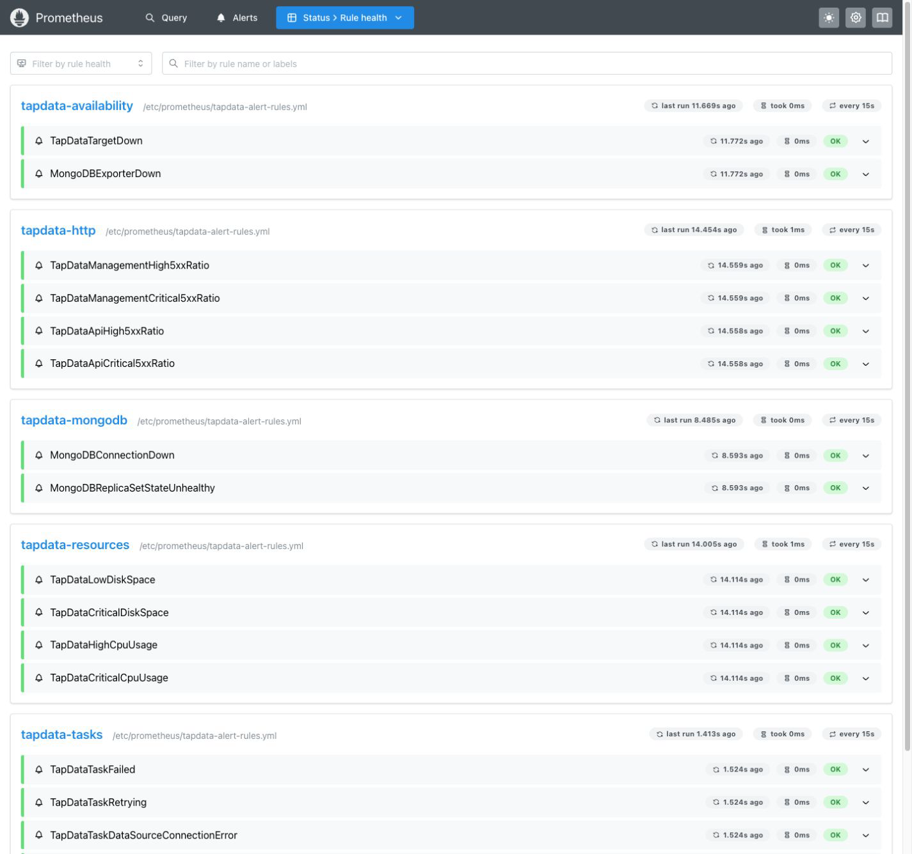

# 部署 Prometheus 监控

import Content from '../../reuse-content/_enterprise-features.md';

<Content />

TapData 可以通过 HTTP 地址提供组件和运行指标。将这些地址接入 Prometheus 后，可使用 Grafana 查看趋势，并通过 Alertmanager 将异常通知给值班人员。任务指标是否可用，需要在当前环境单独确认。

本文介绍从启用监控端点、部署监控服务到检查采集结果的完整流程。完成接入后，可继续阅读：

- [指标说明与健康判定](metrics.md)：了解指标值、曲线变化和建议阈值。
- [Grafana 看板使用指南](grafana.md)：导入模板、选择任务并判读面板。
- [告警配置与监控巡检](alerting.md)：加载告警规则、配置通知和执行故障分级处置。

## 开始前

准备一台能够访问所有 TapData 指标端点的监控服务器，并确认：

- 已安装 Docker 和 Docker Compose，磁盘容量能够保存计划保留周期内的 Prometheus 数据。
- 监控服务器到各 TapData 节点的指标端口网络可达；访问控制只允许监控网络或指定来源。
- 可以在维护窗口重启 TapData，使监控配置生效。
- 已规划 Grafana 管理员密码、告警接收人、通知渠道和至少一个测试任务。
- 如果已有 Prometheus、Grafana 或 Alertmanager，优先接入现有平台，不必重复部署本文中的容器。

完成本页后，您应能够在 Prometheus 的 **Status** > **Target health** 中看到所需目标为 **UP**、在 Grafana 中连接 Prometheus，并在 Prometheus 中确认告警规则已加载。要将告警发送给值班人员，还需要完成[告警通知配置](alerting.md#配置告警通知)。

## 已有监控平台时如何接入

如果组织已经运行 Prometheus、Grafana 或 Alertmanager 中的一个或多个组件，优先复用已有服务，只部署缺少的组件，无需为了接入 TapData 再部署一套完整监控栈。以下步骤以已有 Prometheus 为例；如果尚未部署 Prometheus，请先按照[步骤二](#步骤二部署-prometheusgrafana-和-alertmanager)部署 Prometheus，再继续：

1. 完成[步骤一](#步骤一启用并确认指标端点)，确认监控服务器能够访问实际启用的 TapData 指标端点。
2. 参考[配置 Prometheus](#配置-prometheus)，将通过检查的端点加入现有 `scrape_configs`，并为同一环境设置一致的 `project` 标签。
3. <a href="/resources/TapData_Prometheus_Alert_Rules.yaml">下载 TapData Prometheus 告警规则</a>，再按照[安装和校验规则](alerting.md#安装和校验规则)选择适用的规则组并加载规则。
4. 按照[下载模板](grafana.md#下载模板)和[导入和配置](grafana.md#导入和配置)将所需看板导入现有 Grafana。
5. 执行[步骤三](#步骤三检查监控链路)，验证采集、看板、规则和通知链路。

## 监控范围

| 对象 | 主要用途 | 常用指标地址（需实际验证） |
| --- | --- | --- |
| Management | 服务存活、HTTP 请求、JVM 和主机资源 | `http://<host>:3030/actuator/prometheus` |
| Flow Engine | 任务状态、任务延迟、节点处理耗时（以端点实际输出为准）、JVM 和主机资源 | `http://<host>:3035/actuator/prometheus` |
| Agent | Agent 存活和主机资源 | `http://<host>:3036/metrics` |
| API Server | API 请求、Node.js 运行时和进程资源 | `http://<host>:3080/metrics` |
| MongoDB | 副本集、Oplog、连接和数据库资源 | 由 `mongodb_exporter` 提供，默认为 `http://<host>:9216/metrics` |

:::warning

不同部署形态启用的组件和端点可能不同。先按照[确认端点](#确认端点)进行检查，只为实际返回 HTTP 200 且包含 Prometheus 指标的端点创建抓取作业。端口可以连接，不代表该端点能够返回监控指标。

指标端点通常不要求登录认证。生产环境应通过防火墙、安全组、反向代理或专用监控网络限制访问来源。

:::

## 先了解任务指标的限制

不同部署形态、组件和启用功能可能提供不同指标，实际可用指标以当前环境的指标地址为准。Flow Engine 能够被 Prometheus 正常采集，不代表一定能看到任务状态、连接和延迟；有些环境只提供 JVM、进程和主机指标。

因此，需要分别确认“Prometheus 能够采集组件”和“任务指标存在”。若指标地址没有返回 `task_status`、`task_active_db`、`task_cdc_delay_ms` 等任务指标，任务看板会显示 **No data**，`tapdata-tasks` 规则也无法发现任务异常。此时仍可使用组件存活和资源监控；任务状态、同步进度和数据校验应继续在 TapData 任务监控页面查看。

本文提供的 CPU、磁盘、5xx 比例和持续时间为起始建议，不是 TapData 的固定限制。任务延迟应按照业务 SLA 设置；资源阈值可在收集至少一周的平峰和高峰数据后进行调整。

## 步骤一：启用并确认指标端点

### 启用 TapData 监控

默认情况下，TapData 监控功能未开启。可通过配置文件或环境变量启用。

```mdx-code-block
import Tabs from '@theme/Tabs';
import TabItem from '@theme/TabItem';

<Tabs className="unique-tabs">
<TabItem value="配置文件" label="配置文件" default>
```

登录每台 TapData 服务器，编辑 `application.yml`：

```yaml
tapdata:
  metrics:
    enable: true
    enginePort: 3035
    agentPort: 3036
```

```mdx-code-block
</TabItem>
<TabItem value="环境变量" label="环境变量">
```

登录每台 TapData 服务器，设置下列环境变量，并按照当前部署方式重启 TapData 服务：

```bash
export TAPDATA_MONITOR_ENABLE=true
export TAPDATA_FE_MONITOR_PORT=3035
export TAPDATA_AGENT_MONITOR_PORT=3036
```

```mdx-code-block
</TabItem>
</Tabs>
```

### 确认端点

在将要部署 Prometheus 的服务器上检查实际部署的组件。下面的命令同时检查 HTTP 请求是否成功、返回内容是否为 Prometheus 指标，避免把 JSON 错误信息或登录页面误判为指标。

```bash
check_metrics() {
  url="$1"
  body=$(mktemp)
  if curl -fsS "$url" -o "$body" && grep -qE '^# (HELP|TYPE) ' "$body"; then
    echo "OK: $url"
    grep -m 3 -E '^# (HELP|TYPE) ' "$body"
  else
    echo "INVALID: $url 未返回 Prometheus 指标" >&2
    head -c 300 "$body" >&2
    echo >&2
  fi
  rm -f "$body"
}

check_metrics http://<tapdata-host>:3030/actuator/prometheus
check_metrics http://<tapdata-host>:3035/actuator/prometheus
check_metrics http://<tapdata-host>:3036/metrics
check_metrics http://<tapdata-host>:3080/metrics
```

只有输出 `OK` 的端点才应加入 Prometheus。若输出 `INVALID`、连接拒绝、超时或 404：

1. 确认对应组件是否部署在该节点，以及监控功能是否已经启用并重启生效。
2. 检查实际监听端口、防火墙和容器端口映射。
3. 暂时不要在 `prometheus.yml` 中加入该目标；先根据当前部署包确认该组件如何提供指标。

组件探活与指标采集是两个不同检查。探活端点及成功标准如下：

| 组件 | 探活端点 | 成功标准 |
| --- | --- | --- |
| Management | `http://<host>:3030/health` | HTTP 200，响应中的 `code` 为 `ok` |
| Flow Engine | `http://<host>:3035/actuator/health` | HTTP 200，响应中的 `status` 为 `UP` |
| Agent | `http://<host>:3036/health` | HTTP 200，响应中的 `status` 为 `ok` |
| API Server | `http://<host>:3080/status` | HTTP 200，响应中的 `status` 为 `UP` |

### 确认是否监控 MongoDB 系统库

TapData 使用 MongoDB 保存配置和任务元数据。MongoDB 不会通过 TapData 指标端点自动纳入监控。如需在同一套监控平台中查看 MongoDB 连接、复制集和资源状态，请在后续步骤中[配置 MongoDB 监控](#可选配置-mongodb-监控)。如果 MongoDB 已由数据库团队或云服务统一监控，可跳过该配置，避免重复部署和重复告警。

## 步骤二：部署 Prometheus、Grafana 和 Alertmanager

下面的示例将三个服务部署在同一台监控服务器，并将 Web 端口绑定到该服务器的内网 IP。运维人员可从能够访问该内网地址的电脑直接打开监控页面。

### 准备目录和密码

```bash
mkdir -p tapdata-monitoring
cd tapdata-monitoring
```

创建 `.env` 文件，填写监控服务器的内网 IP 和 Grafana 管理员密码：

```dotenv title=".env"
MONITOR_BIND_IP=<monitor-host-private-ip>
GRAFANA_ADMIN_PASSWORD=<strong-password>
```

```bash
chmod 600 .env
```

<a href="/resources/TapData_Prometheus_Alert_Rules.yaml">下载 TapData Prometheus 告警规则</a>，保存为 `tapdata-alert-rules.yml`，同时创建 `prometheus.yml`、`alertmanager.yml` 和 `docker-compose.yml`。需要根据实际指标选择规则组时，参见[安装和校验规则](alerting.md#安装和校验规则)。

### 配置 Prometheus

以下配置中的 `project` 是 Prometheus 添加的环境标签，供告警分组和 Grafana 变量使用。请将 `tapdata-prod` 和各目标地址替换为实际值，并删除未通过端点检查的抓取作业。

```yaml title="prometheus.yml"
global:
  scrape_interval: 15s
  evaluation_interval: 15s

rule_files:
  - /etc/prometheus/tapdata-alert-rules.yml

alerting:
  alertmanagers:
    - static_configs:
        - targets: ['alertmanager:9093']

scrape_configs:
  - job_name: tapdata-management
    metrics_path: /actuator/prometheus
    static_configs:
      - targets: ['192.168.1.200:3030']
    relabel_configs:
      - target_label: project
        replacement: tapdata-prod

  - job_name: tapdata-flow-engine
    metrics_path: /actuator/prometheus
    static_configs:
      - targets: ['192.168.1.200:3035']
    relabel_configs:
      - target_label: project
        replacement: tapdata-prod

  # 仅在 /metrics 已确认返回指标时保留以下作业
  - job_name: tapdata-agent
    metrics_path: /metrics
    static_configs:
      - targets: ['192.168.1.200:3036']
    relabel_configs:
      - target_label: project
        replacement: tapdata-prod

  - job_name: tapdata-api-server
    metrics_path: /metrics
    static_configs:
      - targets: ['192.168.1.200:3080']
    relabel_configs:
      - target_label: project
        replacement: tapdata-prod

```

多节点部署时，在相应 `targets` 中加入每个节点，不要为同一端点创建重复作业。

### 配置 Alertmanager

以下配置可先用于验证 Prometheus 与 Alertmanager 的连接。`local-only` 不会向外发送通知；上线前必须按照[配置告警通知](alerting.md#配置告警通知)替换为实际接收器。

```yaml title="alertmanager.yml"
route:
  receiver: local-only
  group_by: [alertname, project, instance, task_name]
  group_wait: 30s
  group_interval: 5m
  repeat_interval: 4h

receivers:
  - name: local-only
```

### 配置 Docker Compose

示例固定了容器版本，升级前应先在测试环境验证。Grafana 密码保存在权限为 `600` 的 `.env` 文件中，不写入 `docker-compose.yml`。

```yaml title="docker-compose.yml"
services:
  prometheus:
    image: prom/prometheus:v3.13.1
    container_name: prometheus
    restart: unless-stopped
    volumes:
      - ./prometheus.yml:/etc/prometheus/prometheus.yml:ro
      - ./tapdata-alert-rules.yml:/etc/prometheus/tapdata-alert-rules.yml:ro
      - prometheus_data:/prometheus
    ports:
      - "${MONITOR_BIND_IP:?set MONITOR_BIND_IP in .env}:9090:9090"
    command:
      - --config.file=/etc/prometheus/prometheus.yml
      - --storage.tsdb.path=/prometheus
      - --storage.tsdb.retention.time=30d

  alertmanager:
    image: prom/alertmanager:v0.33.1
    container_name: alertmanager
    restart: unless-stopped
    volumes:
      - ./alertmanager.yml:/etc/alertmanager/alertmanager.yml:ro
      - alertmanager_data:/alertmanager
    ports:
      - "${MONITOR_BIND_IP:?set MONITOR_BIND_IP in .env}:9093:9093"

  grafana:
    image: grafana/grafana:13.1.0
    container_name: grafana
    restart: unless-stopped
    environment:
      GF_SECURITY_ADMIN_USER: admin
      GF_SECURITY_ADMIN_PASSWORD: ${GRAFANA_ADMIN_PASSWORD:?set GRAFANA_ADMIN_PASSWORD}
      GF_USERS_ALLOW_SIGN_UP: "false"
    volumes:
      - grafana_data:/var/lib/grafana
    ports:
      - "${MONITOR_BIND_IP:?set MONITOR_BIND_IP in .env}:3000:3000"

volumes:
  prometheus_data:
  alertmanager_data:
  grafana_data:
```

### 可选：配置 MongoDB 监控

如需监控 TapData 使用的 MongoDB 系统库，请完成以下操作。

1. 由 MongoDB 管理员使用具备用户管理权限的账号连接系统库，在 `admin` 数据库创建只读监控账号：

   ```javascript
   use admin
   db.createUser({
     user: "tapdata_monitor",
     pwd: "<strong-password>",
     roles: [
       { role: "clusterMonitor", db: "admin" },
       { role: "read", db: "local" }
     ]
   })
   ```

   `clusterMonitor` 用于读取服务器和复制集状态，`local` 数据库的读取权限用于获取 Oplog 信息。无需授予 TapData 业务库的写入权限。

2. 在前面创建的 `.env` 文件中增加 MongoDB 连接 URI：

   ```dotenv title=".env"
   MONGODB_URI=mongodb://tapdata_monitor:<url-encoded-password>@<mongo-host>:27017/admin?replicaSet=<replica-set-name>
   ```

   ```bash
   chmod 600 .env
   ```

   如果密码包含 `@`、`:`、`/`、`?` 或 `#` 等字符，需要先进行 URL 编码。单节点或 TLS 部署应根据实际连接方式调整 URI，并删除不适用的副本集参数。

3. 在 `docker-compose.yml` 的 `services` 下增加 `mongodb-exporter`：

   ```yaml
   services:
     mongodb-exporter:
       image: percona/mongodb_exporter:0.51.0
       restart: unless-stopped
       environment:
         MONGODB_URI: ${MONGODB_URI:?set MONGODB_URI in .env}
       command:
         - --collector.diagnosticdata
         - --collector.replicasetstatus
         - --collector.dbstats
       ports:
         - "127.0.0.1:9216:9216"
   ```

   exporter 的 9216 端口只绑定到监控服务器本机，Prometheus 通过 Compose 网络中的服务名访问，无需向运维电脑开放该端口。

4. 在 `prometheus.yml` 的 `scrape_configs` 下增加抓取作业：

   ```yaml
   - job_name: mongodb
     metrics_path: /metrics
     static_configs:
       - targets: ['mongodb-exporter:9216']
     relabel_configs:
       - target_label: project
         replacement: tapdata-prod
   ```

   如果 exporter 没有与 Prometheus 使用同一个 Compose 网络，请将服务名替换为 Prometheus 可以访问的 exporter 地址。

:::tip

您可以先使用独立的测试 MongoDB 检查 exporter、Prometheus 和 Grafana 的配置。正式使用时，仍需将 exporter 连接到 TapData 实际使用的系统库，确认账号权限、TLS 和复制集状态符合预期。未启用复制集的单节点 MongoDB 不提供复制集状态和 Oplog 相关指标。

:::

更多参数说明，参见 [Percona mongodb_exporter 使用参考](https://github.com/percona/mongodb_exporter/blob/main/REFERENCE.md)。

### 启动服务

```bash
docker compose config --quiet
docker compose up -d
docker compose ps
```

命令完成后，Prometheus、Alertmanager 和 Grafana 容器均应为 `Up`；如果配置了 MongoDB 监控，`mongodb-exporter` 也应为 `Up`。如果 Prometheus 反复重启，可执行 `docker compose logs prometheus` 检查配置文件和规则文件路径。

### 登录监控页面

确保运维电脑能够访问监控服务器的内网 IP，然后在浏览器中打开：

| 页面 | 地址与登录方式 | 首次查看内容 |
| --- | --- | --- |
| Prometheus | `http://<monitor-host-private-ip>:9090`。默认没有应用层账号；若通过反向代理访问，以代理账号为准。 | 打开 **Status** > **Target health**，确认必需目标为 UP；打开 **Alerts** 查看规则状态。 |
| Grafana | `http://<monitor-host-private-ip>:3000`。用户名为 `admin`，密码为 `.env` 中设置的 `GRAFANA_ADMIN_PASSWORD`，不是 TapData 登录密码。 | 添加 Prometheus 数据源、导入看板并选择实际的 `project`、`instance` 和任务。 |
| Alertmanager | `http://<monitor-host-private-ip>:9093`。默认没有应用层账号；若通过反向代理访问，以代理账号为准。 | 查看当前 firing 告警、标签和分组；检查预期接收器是否能够收到告警和恢复通知。 |

:::warning

Prometheus 和 Alertmanager 默认不提供登录认证。请将 `MONITOR_BIND_IP` 设置为监控服务器的内网 IP，并通过防火墙或安全组只允许运维网段访问。不要将这些端口直接暴露到公网；如需跨网络访问，应使用带认证和访问控制的反向代理。

:::

## 步骤三：检查监控链路

### 检查抓取目标

打开 `http://<monitor-host-private-ip>:9090/targets`，确认实际启用的作业为 **UP**。未部署的组件不要求出现；已经配置但为 **DOWN** 的目标必须处理或从配置中移除。

在 Prometheus 查询页依次执行：

```promql
# 每个目标最近一次抓取是否成功；1 为成功，0 为失败
up{project="tapdata-prod"}

# 成功目标数
sum(up{project="tapdata-prod"} == 1)

# Flow Engine 是否提供任务状态和延迟指标
count(task_status{project="tapdata-prod",job="tapdata-flow-engine"})
count(task_cdc_delay_ms{project="tapdata-prod",job="tapdata-flow-engine"})
```

`count(...)` 返回 `0` 或无数据时，不要把它解释成“任务正常且数值为 0”。先确认当前是否存在对应类型的运行任务，再直接查看 Flow Engine 指标端点中是否包含该指标：

```bash
curl -fsS http://<tapdata-host>:3035/actuator/prometheus \
  | grep -E '^# (HELP|TYPE) task_(status|active_db|cdc_delay_ms|node_process_data_ms|milestone_status|milestone_time)'
```

按以下结果决定启用范围：

| 检查结果 | 结论与处理 |
| --- | --- |
| Target 为 UP，且能查到实际 `task_*` 任务指标 | 可以启用任务看板和 `tapdata-tasks` 告警规则，并使用一个测试任务验证状态变化。 |
| Target 为 UP，但运行任务期间仍没有上述 `task_*` 指标 | 当前环境仅完成组件级监控。不要把任务面板的 **No data** 或任务规则的 **Inactive** 当作业务正常；在 TapData 任务监控页面查看任务状态，并向 TapData 支持确认当前部署是否提供任务指标。 |
| Target 为 DOWN | 先修复网络、端口、指标路径或组件进程，暂不判断任何业务指标。 |

### 检查 MongoDB 监控

如果配置了 MongoDB 监控，请执行以下检查：

1. 在 Prometheus 的 **Status** > **Target health** 中确认 `mongodb` 作业为 **UP**。
2. 执行 `mongodb_up{job="mongodb"}`，确认结果为 `1`。
3. 检查 exporter 是否返回 MongoDB 指标：

   ```bash
   curl -fsS http://127.0.0.1:9216/metrics \
     | grep -E '^mongodb_(up|rs_myState|rs_members_(state|health)|ss_connections|ss_opcounters|ss_wt_cache_(bytes_currently_in_the_cache|maximum_bytes_configured)|oplog_stats_storageStats_storageSize)'
   ```

4. 对于副本集部署，将 `mongodb_rs_myState`、成员数和连接数与 `rs.status()`、`db.serverStatus().connections` 的结果进行对比。

`up{job="mongodb"}=1` 仅表示 Prometheus 可以采集 exporter；`mongodb_up=1` 才表示 exporter 可以连接 MongoDB。如果只有 `go_*`、`process_*` 等 exporter 自身指标，应检查 MongoDB URI、认证库、TLS、网络和采集项（collector）参数。

:::warning

不要通过停止 TapData 正在使用的 MongoDB 系统库或修改生产复制集来测试告警。可以在维护窗口停止并恢复 `mongodb-exporter`，检查 exporter 不可用告警是否能够触发和恢复。

:::

### 确认告警和看板可用

本节只检查规则、看板和通知链路是否可用。规则选择、通知路由、阈值维护和日常巡检统一参见[Prometheus 告警配置与监控巡检](alerting.md)；模板下载、导入和图表判读统一参见[Grafana 看板使用指南](grafana.md)。

Prometheus 默认不包含 TapData 告警规则。只有完成以下配置并使 Prometheus 应用新配置后，**Status** > **Rule health** 页面才会出现截图中的 `tapdata-*` 规则组；部分 Prometheus 版本将该页面显示为 **Rules**：

- 已<a href="/resources/TapData_Prometheus_Alert_Rules.yaml">下载 TapData Prometheus 告警规则</a>并保存为 `tapdata-alert-rules.yml`。
- `prometheus.yml` 已通过 `rule_files` 引用该文件。
- `docker-compose.yml` 已将规则文件挂载到 Prometheus 容器中的对应路径。

完成上述配置后，按照以下步骤检查：

1. 按照[安装和校验规则](alerting.md#安装和校验规则)加载规则，然后打开 Prometheus 的 **Status** > **Rule health**（部分版本显示为 **Rules**），确认规则组加载成功且没有错误。如果页面为空，请检查 `rule_files`、容器文件挂载和 `docker compose logs prometheus` 的输出。

   

2. 打开 Prometheus 的 **Alerts**，确认规则可以正常评估。
3. 打开 `http://<monitor-host-private-ip>:9093`，确认 Alertmanager 状态正常并能看到 Prometheus 发送的告警。
4. 在 Grafana 中添加 Prometheus 数据源，地址填写 `http://prometheus:9090`；随后[下载模板](grafana.md#下载模板)，并按照[导入和配置](grafana.md#导入和配置)完成导入和数据核对。
5. [配置真实通知接收器](alerting.md#配置告警通知)并[测试通知链路](alerting.md#测试通知链路)。仅看到曲线或规则状态，不代表通知链路已经可用。

## 下一步

- 需要知道曲线高低是否异常：阅读[指标说明与健康判定](metrics.md)。
- 看板无数据或不知道先看哪个面板：阅读[Grafana 看板使用指南](grafana.md)。
- 需要设置阈值、通知路由和故障处理流程：阅读[告警配置与监控巡检](alerting.md)。

相关配置语法可参考 [Prometheus 配置](https://prometheus.io/docs/prometheus/latest/configuration/configuration/)、[Prometheus 告警规则](https://prometheus.io/docs/prometheus/latest/configuration/alerting_rules/)和 [Alertmanager 配置](https://prometheus.io/docs/alerting/latest/configuration/)。
