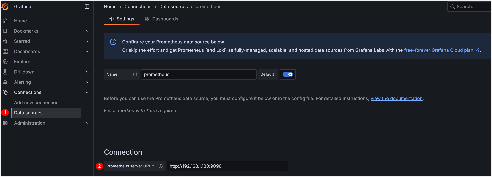
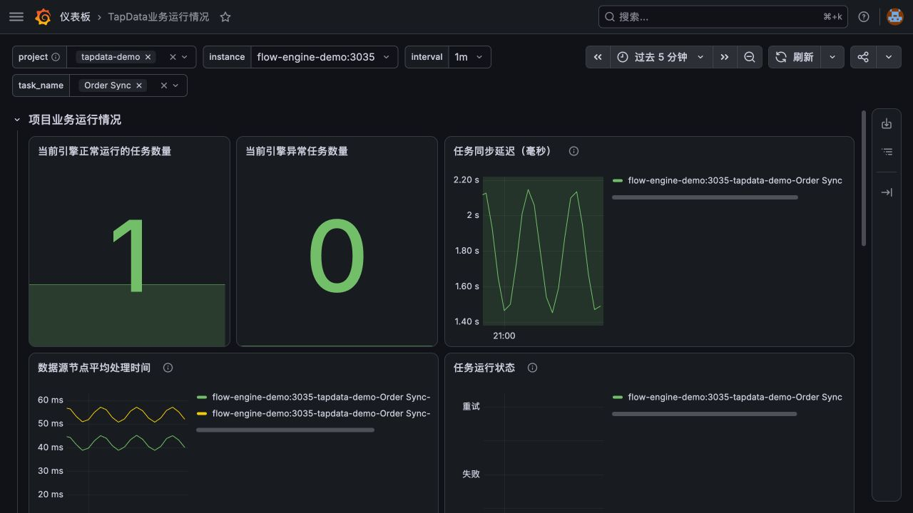
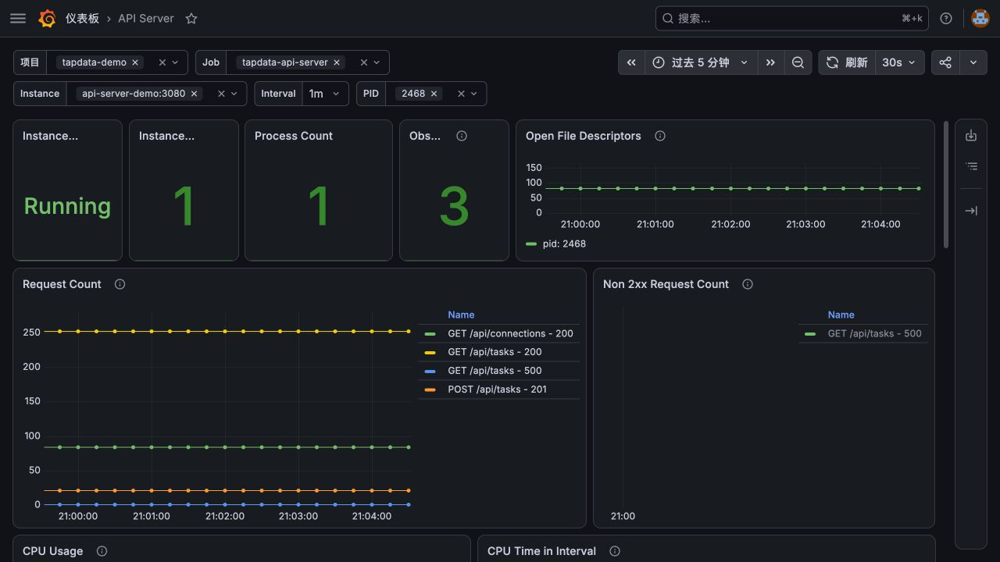
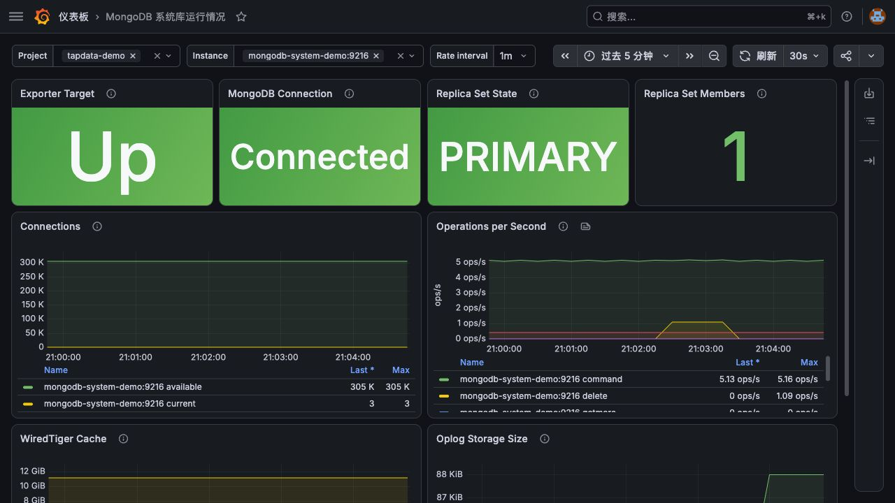

# Grafana 看板使用指南

本文介绍如何导入 Grafana 模板、选择监控范围，以及如何通过看板定位任务、API Server 和 MongoDB 异常。开始前，请先完成[Prometheus 采集检查](deployment.md#步骤三检查监控链路)。

## 下载模板

| 模板 | 适用范围 | 下载 |
| --- | --- | --- |
| TapData 服务监控 | 任务状态、同步延迟、连接状态、节点处理耗时和启动里程碑 | <a href="/resources/TapData_Service_Template.zip">下载</a> |
| API Server | 实例存活、请求量、非 2xx 请求、CPU、内存、GC、文件句柄和日志 | <a href="/resources/API_Service_Template.zip">下载</a> |
| MongoDB | exporter 和数据库连接、复制集状态、连接数、操作速率和 WiredTiger 缓存 | <a href="/resources/MongoDB_Service_Template.zip">下载</a> |

模板用于日常查看和排查趋势，异常通知仍需要使用 Prometheus 告警规则。面板阈值应按照[指标说明与健康判定](metrics.md)，结合任务 SLA 和环境基线调整。

TapData 服务模板需要 Flow Engine 提供 `task_*` 指标。Flow Engine 的 Target 为 **UP**，只说明 Prometheus 能够采集该组件，不代表任务面板一定有数据。

## 导入和配置

1. 在 Grafana 中选择 **Connections** > **Data sources**，添加 Prometheus 数据源。按照本文示例部署时，数据源地址填写 `http://prometheus:9090`，然后单击 **Save & test**。

   

   图中的服务器地址仅为示例，请填写 Grafana 可以访问的 Prometheus 地址。

2. 解压下载文件，得到 JSON 模板。
3. 选择 **Dashboards** > **New** > **Import**，上传 JSON；在导入页的 **Prometheus** 下拉框中选择刚刚添加的数据源，然后完成导入。
4. 根据模板选择监控范围：

   | 模板 | 需要选择的变量 |
   | --- | --- |
   | TapData 服务 | `project`、Flow Engine `instance`、`task_name`、`interval` |
   | API Server | `project`、`job`、`instance`、`pid`、`interval` |
   | MongoDB | `project`、`instance`、`interval` |

5. 先选择单个实例检查数据，确认正确后再使用 **All** 查看汇总结果。

### 第一次打开看板

先将时间范围设为最近 15 分钟，再依次选择 `project`、单个 `instance` 和一个正在运行的 `task_name`。确认状态、延迟和任务名称与 TapData 任务监控页面一致后，再选择 **All** 查看汇总数据。这样可以避免因时间范围过大或一次汇总多个实例而误判。

模板使用 Grafana 的标准 `DS_PROMETHEUS` 输入变量。导入时选择数据源后，Grafana 会将模板中的占位符替换为当前环境的数据源 UID；不需要手工编辑 JSON。若导入页没有显示 **Prometheus** 下拉框，请重新下载本页模板，避免继续使用缺少数据源声明的旧文件。

模板依赖 Prometheus 抓取配置添加的 `project` 标签。导入后无数据时，先在 Prometheus 执行：

```promql
sum(up{project="tapdata-prod"} == 1)
```

如果返回 0 或无数据，先修复抓取配置；如果目标为 UP 但任务变量为空，再检查：

```promql
count(task_status{project="tapdata-prod",job="tapdata-flow-engine"})
count(task_milestone_status{project="tapdata-prod",job="tapdata-flow-engine"})
```

请在至少一个任务运行时完成这项检查。两个查询均无数据时，不要继续修改 Grafana 变量或删除标签过滤条件来“恢复”面板；应先按照[核心任务指标](metrics.md#核心任务指标)中的步骤确认当前环境是否提供任务指标。

## 确认看板数据

导入模板后，按照以下步骤确认看板中的数据与实际环境一致：

1. Prometheus 数据源执行 **Save & test** 成功，Grafana 服务所在环境可以访问该数据源地址。
2. 看板顶部变量能够列出当前环境的 `project`、`job`、`instance`、`task_name` 或 `pid`；选择 **All** 时，有相应指标的面板仍能显示数据。
3. 已确认指标地址提供 `task_status` 时，正常任务数量与计划一致；异常任务为 `0` 时显示绿色，大于等于 `1` 时显示红色。
4. 任务状态和连接状态的数值映射符合[核心任务指标](metrics.md#核心任务指标)，延迟和节点耗时的单位为毫秒。
5. API Server 端点有指标时，Instance State 为 Running，实例数和进程数不应为 0。
6. MongoDB 看板中的 Exporter Target 和 MongoDB Connection 均为 `1`；复制集状态与实际拓扑一致。

## 判读 TapData 服务看板

按照“总览 → 异常任务 → 延迟 → 节点 → 启动阶段”的顺序查看：



图中使用 `tapdata-demo` 演示数据说明正常看板的布局和状态颜色。实际项目、实例、任务、曲线和数值取决于当前环境。

| 面板 | 正常表现 | 异常表现 | 下一步 |
| --- | --- | --- | --- |
| 当前引擎正常运行的任务数量 | 与计划运行任务数一致 | 数量下降或为 0 | 查看异常任务数、任务状态和 Flow Engine `up`。 |
| 当前引擎异常任务数量 | 为 0 | 大于 0，包含失败或重试任务 | 按任务名称定位，检查任务日志和连接。 |
| 任务运行状态 | `0` | `1` 失败；`2` 重试 | 失败立即处理；重试持续 10 分钟按故障处理。 |
| 任务同步延迟 | 在任务 SLA 内，尖峰后回落 | 长期超过 SLA 或持续上升 | 对比节点耗时、源端写入、目标端写入和网络。 |
| 任务数据源连接状态 | `0` | `1` 网络/服务端异常；`2` 凭据无效 | 测试连接并检查数据库、网络、证书和凭据。 |
| 数据源节点平均处理时间 | 在同一节点历史区间内波动 | 与同步延迟一起持续升高 | 定位对应源或目标节点的慢查询、连接数和写入能力。 |
| 任务启动里程碑 | 启动阶段逐步完成 | 长期等待、运行或出现错误 | 查看对应里程碑和任务启动日志。 |

任务延迟没有适用于所有任务的统一正常值。例如，要求 10 秒内完成的任务和允许 5 分钟延迟的任务不能共用同一告警阈值。优先使用任务 SLA；没有 SLA 时，先建立一周基线。

## 判读 API Server 看板



图中使用 `tapdata-demo` 演示数据说明看板布局。实际接口、请求量、进程号和资源曲线取决于当前环境。

1. **Instance State** 为 Down：先在 Prometheus 检查 `up{job="tapdata-api-server"}`，再检查 `/status`、进程和 `/metrics`。
2. **Observed API Routes**：统计当前时间范围内产生过非 404 请求的 `method/path` 组合数量，不表示正在执行的请求数。404 请求通常表示没有匹配到已知接口，因此不计入接口数量。
3. **Request Count**：用于识别流量变化，不配置固定上限。突增时按 `path`、`method` 和 `statusCode` 定位来源。
4. **Non 2xx Request Count**：区分 3xx、4xx 与 5xx。3xx/4xx 不一定是服务端故障；持续增长的 5xx 需要结合服务端日志和依赖状态处理。
5. **CPU Usage、CPU Time in Interval、Memory、Heap 和 GC**：CPU 时间、GC Count 和 GC Duration 均按所选 `interval` 计算，不是进程启动后的累计值。资源指标持续高位并同时出现 5xx、响应变慢或进程重启时升级处理。
6. **Open File Descriptors**：关注持续增长以及与进程上限的比例，单次绝对值不能独立判断故障。

API 模板依赖 `/metrics`。如果 `http://<api-server-host>:3080/metrics` 返回 404，请先确认当前部署是否提供 API Server 指标端点。

## 判读 MongoDB 看板

按照“采集链路 → 数据库连接 → 复制集 → 连接数 → 操作与缓存”的顺序查看：



图中使用独立的单节点副本集和真实 `mongodb_exporter` 指标说明正常看板的布局。实际成员数、连接、操作速率、缓存和 Oplog 大小取决于系统库规格和负载。

1. **Exporter Target** 为 `0`：Prometheus 无法抓取 exporter，先检查 exporter 容器、网络和端口。
2. **MongoDB Connection** 为 `0`：exporter 正常，但无法连接数据库，检查系统库状态、URI、认证库、证书和网络。
3. **Replica Set State**：`1` 为 PRIMARY、`2` 为 SECONDARY、`7` 为 ARBITER；其他状态持续存在时检查复制集。单节点部署没有该指标时，不把 **No data** 当作故障。
4. **Connections**：观察当前连接是否持续增长，以及可用连接是否持续下降。绝对数量应与系统库规格和历史基线比较。
5. **Operations**：操作速率随 TapData 任务和管理操作变化。突增本身不是故障，应与数据库延迟、缓存、磁盘和 TapData 任务影响一起判断。
6. **WiredTiger Cache**：使用量长期接近配置上限，并同时出现磁盘 I/O、复制或任务延迟时，才升级为容量问题。

MongoDB exporter 的部署方法参见[配置 MongoDB 监控](deployment.md#可选配置-mongodb-监控)，指标说明参见[MongoDB 指标](metrics.md#mongodb)。

## 无数据排查

按以下顺序排查，可以避免在 Grafana 中反复修改查询却找不到根因：

1. **端点**：直接访问指标 URL，确认 HTTP 200 且有指标样本。
2. **Target**：在 Prometheus 的 **Status** > **Target health** 中确认对应作业为 **UP**。
3. **指标查询**：在 Prometheus 查询指标名，确认查询有结果。
4. **标签**：检查 `project`、`job`、`instance`、`task_name` 等实际值；MongoDB exporter 的标签还会受版本和启用的采集项（collector）影响。
5. **变量**：在 Grafana 的**仪表板设置** > **变量**中预览变量结果。
6. **时间范围**：选择指标实际产生数据的时间段；任务停止后部分任务指标可能消失。

不要为了显示数据而删除 `project` 或 `job` 过滤条件，否则可能混入其他环境或组件的数据。

**No data** 与数值 `0` 含义不同：

| 显示结果 | 含义 |
| --- | --- |
| `0` | 查询找到了指标数据，当前值为零。 |
| **No data** | 当前查询条件和时间范围内没有匹配的数据。 |

即使任务正在运行，只要当前环境没有提供任务指标，任务面板仍会显示 **No data**。此时按上述顺序检查指标地址、Target、指标查询和标签，不要直接判断任务正常或异常。

## 日常使用建议

- 将总览、任务详情和组件资源分层，不在一个页面堆叠所有原始指标。
- 面板标题写明单位，状态值使用 Value Mapping，阈值颜色与告警等级保持一致。
- 对发布、扩容和任务配置变更添加 Annotation，便于解释曲线突变。
- 看板 JSON 与告警规则一并纳入版本管理；修改后记录原因和验证结果。
- Grafana 适合趋势分析，Prometheus/Alertmanager 负责规则评估和通知，不要依赖人工盯屏发现故障。

更多设计建议参见 [Grafana dashboard best practices](https://grafana.com/docs/grafana/latest/dashboards/build-dashboards/best-practices/)和 [Grafana variables](https://grafana.com/docs/grafana/latest/dashboards/variables/)。
