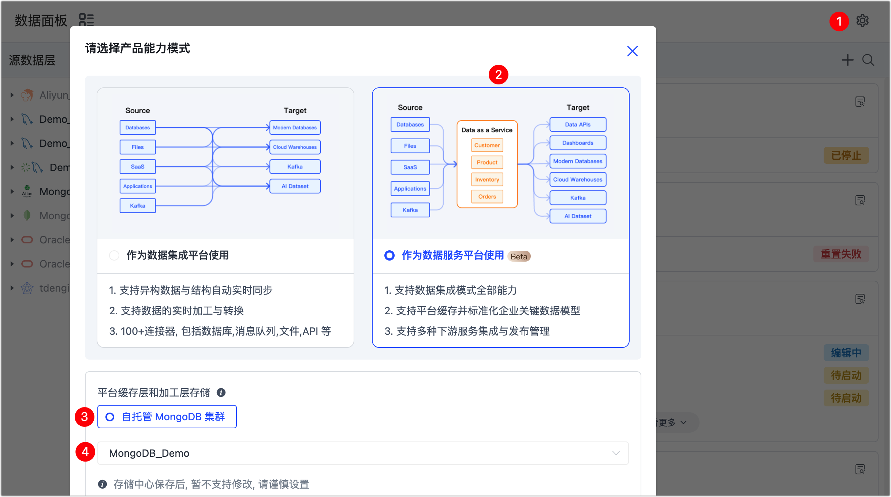

# 开启数据服务平台模式

随着数字化转型的持续深入，数据孤岛问题已逐渐成为主要的阻碍，同时业务对数据需求日益增多，传统的数据交付因其周期长、资源投入大而成为交付瓶颈，如何快速打通数据流转通道，发掘数据价值，已成为企业竞争力的关键因素。

借助 Tapdata 的数据服务平台模式，您可以将分散在不同业务系统的数据同步至统一的平台缓存层，可为后续的数据加工和业务提供基础数据，从而构建一致、实时的数据平台，连通数据孤岛。

## 数据服务平台分层介绍

随着源库承载的任务增多，为最大限度地降低数据提取对源库的影响，同时契合组织对数据分层治理的理念，Tapdata 根据数据流转顺序，将数据服务平台分层如下：

- **源数据层**：Tapdata 将来自不同业务系统的数据源，抽象为统一的数据源层，建立打通数据孤岛的第一步，更多介绍，见[连接数据源](../../connect-database/README.md)。
- **平台缓存层**：可将源库的表数据提前同步至统一的平台缓存层，避免在后续执行复杂数据加工时直接读取/操作源库的数据，配合[共享挖掘](../../data-pipeline/share-mining.md)，极大降低对源库所属业务的影响。
- **平台加工层**：基于平台缓存层的数据，执行定制化的加工运算生成最终业务要用的模型数据。
- **数据目标和服务层**：Tapdata 将支持作为目标的数据源集中展示在数据目标和服务层，您可以将加工后的数据提供给业务使用，从而为企业构建统一的数据服务平台。

| 分层                 | 说明                                                         |
| -------------------- | ------------------------------------------------------------ |
| **源数据层**         | Tapdata 将来自不同业务系统的数据源，抽象为统一的数据源层，建立打通数据孤岛的第一步，更多介绍，见[连接数据源](../../connect-database/README.md)。 |
| **平台缓存层**       | 可将源库的表数据提前同步至统一的平台缓存层，避免在后续执行复杂数据加工时直接读取/操作源库的数据，例如调整表字段、计算字段、合并表等操作，同时配合[共享挖掘](../../data-pipeline/share-mining.md)，可极大降低对源库所属业务的影响。 |
| **平台加工层**       | 基于平台缓存层的数据，执行定制化的加工运算生成最终业务要用的模型数据。 |
| **数据目标和服务层** | Tapdata 将支持作为目标的数据源集中展示在数据目标和服务层，您可以将加工后的数据提供给业务使用，从而为企业构建统一的数据服务平台。 |

## 准备工作

1. 准备一个 MongoDB 数据库（4.0 及以上），将其作为平台缓存层/平台加工层的存储引擎，相关部署介绍，见 [MongoDB 官网](https://www.mongodb.com/docs/manual/administration/install-on-linux/)。

   :::tip

   为保障业务高可用性，推荐 MongoDB 采用副本集/分配集群架构，同时需基于源数据层的数据规模预留足够的存储空间。

   :::

2. [连接 MongoDB 数据库](../../connect-database/certified/connect-mongodb.md)。

## 操作步骤

Tapdata 默认处于数据集成模式，接下来，我们将介绍如何开启数据服务平台模式。

1. 登录 Tapdata 平台。

2. 在左侧导航栏，单击**数据面板**。

3. 在页面右侧，单击图标。

4. 选择数据服务平台模式，然后设置平台缓存层/平台加工层所用的存储引擎，即我们在准备工作中设置的 MongoDB 数据源。

   

   :::tip

   存储引擎一旦选定保存，后续无法修改，请谨慎操作。

   :::

5. 单击**保存**。

   

