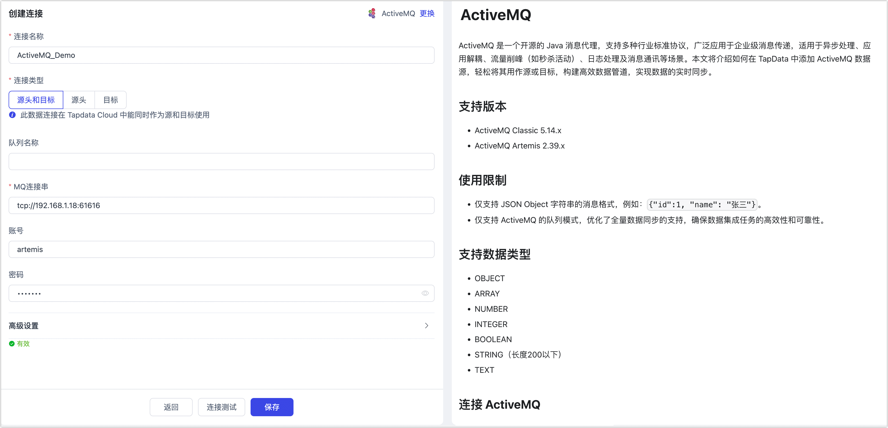

# ActiveMQ

ActiveMQ 是一个开源的 Java 消息代理，支持多种行业标准协议，广泛应用于企业级消息传递，适用于异步处理、应用解耦、流量削峰（如秒杀活动）、日志处理及消息通讯等场景。本文将介绍如何在 TapData 中添加 ActiveMQ 数据源，轻松将其用作源或目标，构建高效数据管道，实现数据的实时同步。

## 支持版本

- ActiveMQ Classic 5.14.x
- ActiveMQ Artemis 2.39.x

## 使用限制

- 仅支持 JSON Object 字符串的消息格式，例如：`{"id":1, "name": "张三"}`。
- 仅支持 ActiveMQ 的队列模式，优化了全量数据同步的支持，确保数据集成任务的高效性和可靠性。

## 支持数据类型

- OBJECT
- ARRAY
- NUMBER
- INTEGER
- BOOLEAN
- STRING（长度200以下）
- TEXT

## 连接 ActiveMQ

1. [登录 Tapdata 平台](../../user-guide/log-in.md)。

2. 在左侧导航栏，单击**连接管理**。

3. 在页面右侧，单击**创建连接**。

4. 在跳转到的页面，搜索并选择 **ActiveMQ**。

5. 根据下述说明完成 ActiveMQ 数据源配置。

   

    * **连接信息设置**
      * **连接名称**：填写具有业务意义的独有名称。
      * **连接类型**：支持将 ActiveMQ 作为源或目标库。
      * **队列名称**：默认为空，TapData 将加载所有队列（Queue），您也可以手动指定，多个队列名称间采用英文逗号（,）分隔。
      * **MQ 连接串**：连接串信息，格式为 `tcp://{host_or_ip}:{port}`，例如 `tcp://192.168.1.18:61616`。
      * **账号**、**密码**：分别需要填写 ActiveMQ 连接的账号和密码。
    * **高级设置**
      * **Agent 设置**：默认为**平台自动分配**，您也可以手动指定。
      * **模型加载频率**：数据源中模型数量大于 1 万时，Tapdata 将按照本参数的设定定期刷新模型。

6. 单击**连接测试**，测试通过后单击**保存**。

   :::tip

   如提示连接测试失败，请根据页面提示进行修复。

   :::