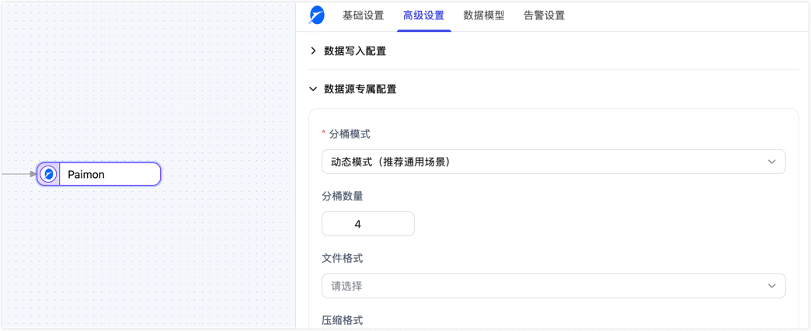

# Paimon

import Content1 from '../../reuse-content/_enterprise-and-community-features.md';

<Content1 />

Apache Paimon（简称 Paimon）是一种数据湖格式，支持使用 Flink 和 Spark 构建实时湖仓架构，用于流式和批处理操作。TapData 支持将 Paimon 作为源或目标库，用于实时数据湖构建。


```mdx-code-block
import Tabs from '@theme/Tabs';
import TabItem from '@theme/TabItem';
```

## 支持版本

Paimon 0.6+ 版本（推荐 0.8.2+）

## 支持同步的操作

**仅 DML 操作**：INSERT、UPDATE、DELETE

:::tip

- 作为源库时，支持全量读取和基于 Paimon Snapshot 的增量读取，不支持采集 DDL 操作。
- 作为目标库时，不支持运行时动态模型变更；如需创建或调整目标表结构，请在任务启动前完成。

:::

## 支持的数据类型

支持 Paimon 0.6+ 版本的所有数据类型，为保障数据精度，建议参考[官方文档](https://paimon.apache.org/docs/master/concepts/spec/fileformat/)设置表列类型映射，如 Parquet 格式下 DATE 类型推荐使用 INT32 存储。

:::tip

您可以通过增加类型修改的[处理节点](../../user-guide/data-development/process-node.md#类型修改)，来修改目标 Paimon 表的类型，从而实现数据类型的转换。

:::

## 注意事项

- 将 Paimon 作为源库时，TapData 需要读取 Paimon 仓库元数据和表数据，请确保 TapData Agent 可访问仓库路径，并具备列举数据库、列举表、读取表结构和读取数据文件的权限。
- 将 Paimon 作为源库进行增量同步时，TapData 基于 Paimon Snapshot 读取变更；任务首次进入增量且没有可用断点时，会从当前最新 Snapshot 之后开始读取，不会回放该 Snapshot 之前的历史变更。
- Paimon 源端读取更新事件时，会基于 Paimon RowKind 输出变更记录；如果下游强依赖原生 UPDATE 语义，建议先在测试环境验证更新、删除场景的处理结果。
- 为避免并发冲突和降低 Compaction 压力，将数据同步到 Paimon 时，为任务的目标节点建议关闭多线程写入，同时将单次写入条数改大到 1,000，超时时间改为 1,000（毫秒）。
- 始终为表定义主键以实现高效更新删除，如表规模较大，推荐使用分区功能以提升查询/写入性能。
- Paimon 仅支持主键（不支持传统索引），不支持运行时动态模型变更。
- Paimon 作为目标库并开启软删除时，TapData 会将 DELETE 转换为带删除标记的 UPDATE。由于 Paimon 的 UPDATE 需要完整行数据，源端 DELETE 事件必须提供完整 before；否则主键外字段可能写入为 null。当源库为 MongoDB（6.0及以上版本）请开启其节点的**[文档原像](../on-prem-databases/mongodb.md#节点高级特性)**功能，其他源端请确保 CDC 日志包含 DELETE 前的完整行数据。

## 连接 Paimon

1. [登录 Tapdata 平台](../../user-guide/log-in.md)。

2. 在左侧导航栏，单击**连接管理**。

3. 单击页面右侧的**创建**。

4. 在弹出的对话框中，搜索并选择 **Paimon**。

5. 在跳转到的页面，根据下述说明填写 Paimon 的连接信息。

   

    - **基本设置**
      - **连接名称**：填写具有业务意义的独有名称。
      - **连接类型**：支持将 Paimon 作为源或目标库。
      - **仓库路径**：Paimon 存储数据的根路径，存储类型为 S3 时，填写示例为 `s3://bucket/path`；存储类型为 HDFS 时，填写示例为 `hdfs://namenode:port/path`；存储类型为 OSS 时，填写示例为 `oss://bucket/path`；存储类型为本地文件系统时，填写示例为 `/local/path/to/warehouse`。请确保 TapData Agent 可访问该路径；作为源库时，需具备读取仓库元数据和表数据的权限；作为目标库时，还需具备写入、创建和删除权限。
      - **存储类型**：Paimon 支持多种存储类型，包括 S3、HDFS、OSS 和本地文件系统，根据实际场景选择合适的存储类型。
        ```mdx-code-block
        <Tabs className="unique-tabs">
        <TabItem value="S3" default>
        ```
        支持标准 S3 协议的对象存储服务，如 AWS S3、MinIO 等，需要填写下述配置：

        * **S3 端点**：填写 S3 服务端点，包含端口号，例如：`http://192.168.1.57:9000/`
        * **S3 访问密钥**：填写 S3 服务的访问密钥 ID
        * **S3 密钥**：填写 S3 服务的密钥
        * **S3 区域**：填写 S3 服务的区域，例如：`us-east-1`
        * **权限要求**：作为源库时，访问密钥需具备列举 Bucket/目录和读取对象的权限；作为目标库时，还需具备写入对象、删除对象等权限。

        </TabItem>
        <TabItem value="HDFS">

        支持 HDFS 协议的文件系统，如 Apache Hadoop HDFS 等，需要填写下述配置：

        * **HDFS 主机**：填写 HDFS 服务的主机名，例如：`192.168.1.57`
        * **HDFS 端口**：填写 HDFS 服务的端口号，例如：`9000`
        * **HDFS 用户**：填写 HDFS 服务的操作用户，例如：`hadoop`
        * **权限要求**：作为源库时，HDFS 用户需具备仓库路径及其子目录的读取和执行权限；作为目标库时，还需具备写入、创建和删除权限。

        </TabItem>
        <TabItem value="OSS">

        支持 OSS 协议的对象存储服务，如阿里云 OSS 等，需要填写下述配置：

        * **OSS 端点**：填写 OSS 服务端点，包含端口号，例如：`https://oss-cn-hangzhou.aliyuncs.com`
        * **OSS 访问密钥**：填写 OSS 服务的访问密钥 ID
        * **OSS 密钥**：填写 OSS 服务的密钥
        * **权限要求**：作为源库时，访问密钥需具备列举 Bucket/目录和读取对象的权限；作为目标库时，还需具备写入对象、删除对象等权限。

        </TabItem>
        <TabItem value="Local">

        支持本地文件系统，该路径需要在 TapData 服务所在节点可访问。作为源库时，TapData Agent 运行用户需具备仓库路径及其子目录的读取权限；作为目标库时，还需具备写入、创建和删除权限。

        </TabItem>
        </Tabs>
      - **数据库名称**：一个连接对应一个数据库，默认为 default，如有多个数据库则需创建多个数据连接。
    - **高级设置**
      - **Agent 设置**：默认为**平台自动分配**，您也可以手动指定 Agent。
      - **模型加载时间**：如果数据源中的模型数量少于10,000个，则每小时更新一次模型信息。但如果模型数量超过10,000个，则刷新将在您指定的时间每天进行。

6. 单击页面下方的**连接测试**，提示通过后单击**保存**。

   :::tip

   如提示连接测试失败，请根据页面提示进行修复。

   :::

## 节点高级特性

在配置数据同步/转换任务时，将 Paimon 作为目标节点时，您可以在节点的高级配置中，进一步设置建表与写入相关参数，以更好平衡写入性能、表组织方式和存储成本。




:::tip

以下与建表相关的配置，主要在目标表不存在且由 Tapdata 自动建表时生效；如果目标表已存在，则默认沿用现有表结构与表属性，不会自动改写已有配置。

:::

| 配置 | 说明 |
| --- | --- |
| **Hash 键** | 默认关闭。开启后，如果主键或更新条件字段超过 5 个，TapData 会在自动创建的 Paimon 表中增加 `_hash_key` 字段并以其作为主键，以降低宽主键场景下的写入开销。建议仅在主键字段较多、写入性能受影响时开启。 |
| **分区键** | 默认为空，用于为自动创建的目标表指定分区字段；置空表示不启用分区。建议在大表，或需要按日期、业务维度组织数据的场景中使用。 |
| **分桶模式** | 支持**动态模式**（默认）和**固定模式**。动态模式适合通用场景；固定模式通常能提供更稳定的写入性能，但需要配合**分桶数量**一起设置。 |
| **分桶数量** | 默认值为 **4**。分桶模式为**固定模式**时，该参数用于指定 Paimon 表的桶数；分桶模式为**动态模式**时，TapData 写入时也会基于该值计算动态桶写入位置。建议结合数据量、并发写入情况和小文件控制需求综合设置。 |
| **文件格式** | 默认为空，表示使用 Paimon 默认文件格式；也可在自动建表时指定为 ORC、Parquet、Avro、CSV、JSON、Lance 或 Blob。建议根据查询引擎兼容性、压缩比和读写性能要求选择。 |
| **压缩格式** | 默认为空，表示使用 Paimon 默认压缩设置；也可指定为 None、Snappy、LZ4、ZSTD、GZIP 或 BZIP2。通常需要在压缩率、CPU 消耗与读写性能之间进行权衡。 |
| **表属性** | 默认为空，支持以键值对的形式追加 Paimon 表属性，用于进一步控制表行为。适合需要细粒度定制建表参数的场景。 |
| **写入缓冲区大小（MB）** | 控制写入时的内存缓冲区大小，默认值为 **256 MB**，可设置范围为 64 ~ 2048 MB。适当调大可以提升吞吐量，但也会增加内存占用。 |
| **数据磁盘溢写** | 默认关闭。开启后，TapData 会启用 Paimon 写入缓冲区的磁盘溢写能力，并可继续配置**磁盘溢写容量(GB)**和**磁盘临时目录**。 |
| **磁盘溢写容量(GB)** | 仅在开启**数据磁盘溢写**后显示，默认值为 **1 GB**，可设置范围为 1 ~ 10 GB，用于限制写入缓冲区溢写到磁盘的最大容量。 |
| **磁盘临时目录** | 仅在开启**数据磁盘溢写**后显示，默认值为 `/tmp`，用于指定 Paimon 写入过程中磁盘溢写使用的临时目录。请确保 TapData Agent 对该目录具备读写权限，并预留足够磁盘空间。 |
| **批量累积大小** | 控制提交前累积的记录数，默认值为 **100000**，可设置范围为 0 ~ 1000000。设置为 0 表示不累积，写入后立即提交；适当调大可提升吞吐量，但会增加未提交数据的累积量。 |
| **提交间隔（毫秒）** | 控制提交的时间间隔，默认值为 **30000** 毫秒，可设置范围为 0 ~ 300000 毫秒。设置为 0 表示不按时间间隔触发提交，仅按**批量累积大小**触发提交。 |
| **启用异步提交** | 默认启用。开启后，TapData 会基于**提交间隔（毫秒）**定期检查并提交已累积的数据，以减少写入阻塞并提升吞吐量。 |
| **写入线程数** | 控制 Paimon 表的写入并行度，默认值为 **4**，可设置范围为 1 ~ 32。在资源充足时适当调大可提升写入并发能力，但也会带来更高的资源消耗。 |
| **启用自动压缩** | 默认启用，用于控制是否启用自动 Compaction。开启后有助于减少小文件并改善查询性能；关闭后可降低压缩开销，但可能产生更多小文件。 |
| **压缩间隔（分钟）** | 在启用自动压缩后生效，用于控制自动压缩的执行间隔，默认值为 **30** 分钟，可设置范围为 1 ~ 1440 分钟。 |
| **目标文件大小（MB）** | 控制目标数据文件大小，默认值为 **128 MB**，可设置范围为 32 ~ 1024 MB。适当调大有助于减少小文件数量，但会提高单文件的处理成本。 |
| **是否更新主键** | 默认关闭。开启后，当检测到主键值发生变化时，系统会将更新操作转换为“删除旧记录 + 写入新记录”。该功能要求源端能够提供更新前数据；若无法提供，任务会报错，且开启后会降低更新性能。 |
