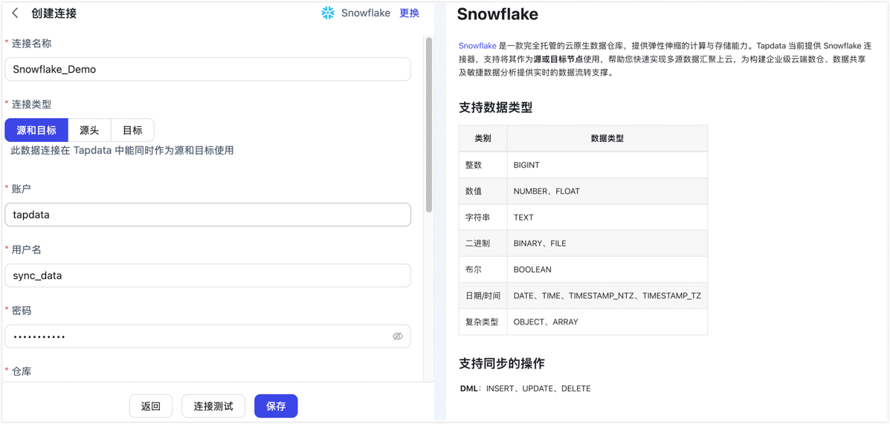

# Snowflake

import Content1 from '../../reuse-content/\_all-features.md';

<Content1 />

[Snowflake](https://www.snowflake.com/) 是一款完全托管的云原生数据仓库，提供弹性伸缩的计算与存储能力。Tapdata 当前提供 Snowflake 连接器，支持将其作为**源或目标节点**使用，帮助您快速实现多源数据汇聚上云，为构建企业级云端数仓、数据共享及敏捷数据分析提供实时的数据流转支撑。

```mdx-code-block
import Tabs from '@theme/Tabs';
import TabItem from '@theme/TabItem';
```

## 支持的版本

所有支持 JDBC 连接的 Snowflake 版本。

## 支持数据类型

| 类别    | 数据类型                                                  | 说明                      |
| ----- | ----------------------------------------------------- | ----------------------- |
| 整数    | BIGINT                                                | -                       |
| 数值    | NUMBER、FLOAT、DECFLOAT                                 | DECFLOAT 仅用于查询侧识别       |
| 字符串   | TEXT、UUID                                             | UUID 仅用于查询侧识别           |
| 二进制   | BINARY、FILE                                           | -                       |
| 布尔    | BOOLEAN                                               | -                       |
| 日期/时间 | DATE、TIME、TIMESTAMP\_NTZ、TIMESTAMP\_TZ、TIMESTAMP\_LTZ | TIMESTAMP\_LTZ 仅用于查询侧识别 |
| 半结构化  | OBJECT、ARRAY、VARIANT                                  | VARIANT 仅用于查询侧识别        |
| 地理空间  | GEOGRAPHY、GEOMETRY                                    | 仅用于查询侧识别                |

:::tip

“仅用于查询侧识别”表示连接器可识别和读取该类型，但不建议直接依赖其自动建表或写入能力。作为目标库写入时，如遇到写入侧不支持或自动建表不符合预期的字段类型，请在任务的字段映射中转换为兼容类型。

:::

## 支持同步的操作

- **DML**：INSERT、UPDATE、DELETE
- **DDL**：作为源库时不支持采集 DDL；作为目标库时，在上游任务产生对应结构变更事件的前提下，可处理自动建表和字段级变更，包括新增字段、修改字段名、修改字段属性和删除字段。

:::tip

- Snowflake 作为源库时，支持通过字段轮询实现增量同步；不支持基于日志、Snowflake Stream 或 Change Tracking 的 CDC 采集，也不支持采集 DDL 操作。字段轮询的配置方式，详见[变更数据捕获（CDC）](../../introduction/change-data-capture-mechanism.md)。
- Snowflake 作为目标库时，您可以通过任务节点的高级配置，选择 DML 写入策略，例如插入冲突时转为更新或忽略，更新无匹配记录时转为插入或记录日志。

:::

## 注意事项

- 作为源库读取数据或执行字段轮询增量同步时，会消耗所选 Snowflake Warehouse 的计算资源，建议为同步任务配置独立的 Warehouse，避免与业务查询争用资源。
- 当前连接器发现和同步的对象以物理表为主，不将视图（View）作为可同步表对象。
- 作为目标库自动建表时，默认创建标准表。如需使用混合表或动态表，请先确认业务场景满足 Snowflake 对应表类型的限制，更多介绍，见[节点高级特性](#节点高级特性)。

## 准备工作

1. 确保 TapData 所属服务端可访问 Snowflake 服务，即可访问 `*.snowflakecomputing.com` 域名和 443 端口。
2. 登录 Snowflake 数据库，执行下述格式的命令，创建用于数据同步的账号与角色。
   ```sql
   -- 下例使用密码认证创建用户，请将 role_name、username、password、warehouse_name、database_name、schema_name 替换为实际值
   CREATE ROLE IF NOT EXISTS <role_name>;

   CREATE USER <username>
      PASSWORD = '<password>'
      DEFAULT_ROLE = <role_name>
      DEFAULT_WAREHOUSE = <warehouse_name>
      DEFAULT_NAMESPACE = <database_name>.<schema_name>
      MUST_CHANGE_PASSWORD = FALSE;

   GRANT ROLE <role_name> TO USER <username>;
   ```
   如需使用 PAT 令牌或密钥对认证，请先在 Snowflake 中为该用户准备对应凭据，并确保该用户仍具备下述角色和权限。使用 PAT 令牌时，请同时确认 Snowflake 账号已满足[程序化访问令牌](https://docs.snowflake.com/en/user-guide/programmatic-access-tokens)所需的网络策略或认证策略要求。

## 连接 Snowflake

1. [登录 TapData 平台](../../user-guide/log-in.md)。
2. 在左侧导航栏，单击**连接管理**。
3. 单击页面右侧的**创建**。
4. 在弹出的对话框中，搜索并选择 **Snowflake**。
5. 在跳转到的页面，根据下述说明填写 Snowflake 的连接信息。

   
   - 基本设置
     - **连接名称**：填写具有业务意义的独有名称。
     - **连接类型**：支持将 Snowflake 作为源或目标节点。
     - **账户**：Snowflake 账户标识，获取方式，请参考[Snowflake 官网文档](https://docs.snowflake.com/en/user-guide/admin-account-identifier)。
     - **用户名**：拥有连接权限的 Snowflake 用户名。
     - **认证方式**：选择连接 Snowflake 的认证方式，支持**普通密码**、**PAT 令牌**和**密钥对**。
     - **密码**：选择**普通密码**认证时，填写用户名对应的密码。
     - **PAT 令牌**：选择 **PAT 令牌**认证时，填写已在 Snowflake 中创建的令牌。
     - **私钥**、**私钥密码**：选择**密钥对**认证时，上传或填写私钥；如果私钥已设置密码，还需填写私钥密码。
     - **仓库**：指定连接使用的计算仓库名称。
     - **数据库**：要连接的数据库（Database）名称。
     - **模式**：数据库中的模式（Schema）名称，默认为 **PUBLIC**，如需使用其他模式请手动修改。
     - **角色**：可选项，未填写时默认使用用户在 Snowflake 中配置的默认角色。
     - **时区**：默认为 0 时区，如果更改为其他时区，不带时区的字段会受到影响。
   - 高级设置
     - **包含表**：默认为**全部**，您也可以选择自定义并填写包含的表，多个表之间用英文逗号（,）分隔。
     - **排除表**：打开该开关后，可以设定要排除的表，多个表之间用英文逗号（,）分隔。
     - **Agent 设置**：默认为**平台自动分配**，您也可以手动指定 Agent。
     - **模型加载时间**：如果数据源中的模型数量少于10000个，则每小时更新一次模型信息。但如果模型数量超过10,000个，则刷新将在您指定的时间每天进行。
6. 单击页面下方的**连接测试**，提示通过后单击**保存**。

   :::tip

   如提示连接测试失败，请根据页面提示进行修复。

   :::

## 节点高级特性

在配置数据同步/转换任务时，如果将 Snowflake 作为目标节点，您可以在节点高级配置中选择目标端自动建表类型。该配置主要影响 TapData 自动创建的目标表；如果目标表已存在，TapData 会沿用目标表当前定义。

| 配置        | 说明                                                                                                                                                                |
| --------- | ----------------------------------------------------------------------------------------------------------------------------------------------------------------- |
| **建表类型**  | 创建目标表时使用的表类型，支持**标准表**（STANDARD，默认）、**混合表**（HYBRID）和**动态表**（DYNAMIC）。标准表适合大多数同步写入场景；混合表要求表具备主键，适合需要主键级更新和点查询的场景；动态表由查询语句定义，不适合作为承接普通 INSERT、UPDATE、DELETE 写入的目标表。 |
| **目标延迟**  | 仅当建表类型为**动态表**时生效，用于设置动态表的目标延迟，默认值为 `1 minute`，也可以按 Snowflake 语法填写 `DOWNSTREAM` 等值。                                                                               |
| **动态表查询** | 仅当建表类型为**动态表**时生效，用于填写定义动态表内容的 `AS SELECT` 查询语句。使用动态表时该项不能为空，且查询语句需满足 Snowflake 对动态表的要求。                                                                          |

## 常见问题

- 问：连接测试失败时应如何排查？

  答：请先确认 TapData 所属服务端可访问 `*.snowflakecomputing.com` 域名和 443 端口，然后检查账户标识、用户名、认证凭据、Warehouse、数据库、Schema 和角色是否正确。如使用 PAT 令牌或密钥对认证，请确认凭据已在 Snowflake 中配置并处于可用状态。
- 问：字段类型或自动建表结果不符合预期时应如何处理？

  答：请先检查源端字段类型是否在[支持数据类型](#支持数据类型)范围内。对于读取侧可识别但写入侧不一定适合直接建表的类型，建议在任务的字段映射中转换为 Snowflake 目标端兼容的类型；如目标表需要特定表类型、字段定义或约束，也可以在同步前手动建表。

