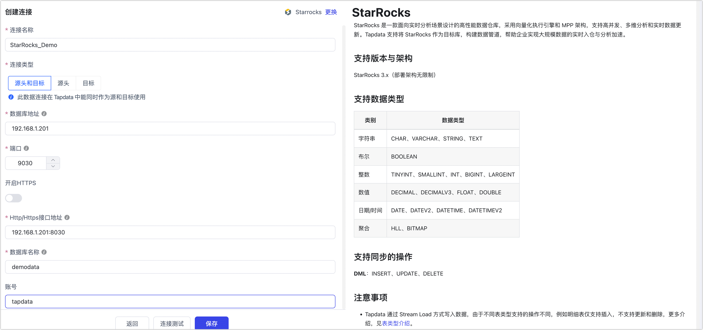

# StarRocks

import Content1 from '../../reuse-content/_all-features.md';

<Content1 />

StarRocks 是一款面向实时分析场景设计的高性能数据仓库，采用向量化执行引擎和 MPP 架构，支持高并发、多维分析和实时数据更新。Tapdata 支持将 StarRocks 作为源或目标库，构建数据管道，帮助企业实现大规模数据的实时入仓与分析加速。

```mdx-code-block
import Tabs from '@theme/Tabs';
import TabItem from '@theme/TabItem';
```

## 支持版本与架构

StarRocks 3.x（部署架构无限制）

## 支持数据类型

| 类别      | 数据类型                                 |
| --------- | ---------------------------------------- |
| 字符串    | CHAR、VARCHAR、STRING、TEXT              |
| 布尔      | BOOLEAN                                  |
| 整数      | TINYINT、SMALLINT、INT、BIGINT、LARGEINT |
| 数值      | DECIMAL、DECIMALV3、FLOAT、DOUBLE        |
| 日期/时间 | DATE、DATEV2、DATETIME、DATETIMEV2       |
| 聚合      | HLL、BITMAP                              |

## 支持同步的操作

* **DML（仅作为目标库）**：INSERT、UPDATE、DELETE
* **DDL 应用（仅作为目标库）**：新增字段、修改字段属性、删除字段。

:::tip

作为源库时，仅支持全量同步，不支持增量 CDC 或采集 DDL。

:::

## 注意事项

* Tapdata 通过 Stream Load 方式写入数据，由于不同表类型支持的操作不同，例如明细表仅支持插入，不支持更新和删除，更多介绍，见[表类型介绍](https://docs.mirrorship.cn/zh/docs/table_design/table_types/)。

  :::tip

  TapData 不会自动创建 StarRocks 表分区。如目标表需要分区，请在同步前手动建表并定义分区。对于 TapData 自动创建的目标表，可在目标节点高级设置中按需配置分桶键、分桶数和排序字段。

  :::

* 作为同步目标库时应尽量避免频繁的事务性操作（如频繁更新和删除），以免影响写入性能。

* 为提升大批量数据插入的性能，建议在配置数据同步时，根据单条记录的大小，将写入的批次大小配置为 1 万 ~ 10 万条记录，注意避免设置过大以免引发 OOM 问题。

* 进行大规模数据入仓时，建议在业务低峰期执行，以避免占用数据库 I/O 资源，影响查询性能。

  
## 准备工作

1. 登录 StarRocks 数据库，执行下述格式的命令，创建用于数据同步/开发任务的账号。

   ```sql
   CREATE USER 'username'@'host' IDENTIFIED BY 'password';
   ```

   - **username**：用户名。
   - **password**：密码，更多认证方式（如 LDAP），见 [CREATE USER](https://docs.mirrorship.cn/zh/docs/sql-reference/sql-statements/account-management/CREATE_USER)。
   - **host**：允许该账号登录的主机，百分号（%）表示允许任意主机。

   示例：创建一个名为 tapdata 的账号。

   ```sql
   CREATE USER 'tapdata'@'%' IDENTIFIED BY 'Tap@123456';
   ```

2. 根据连接类型，为刚创建的账号授予权限。

     ```mdx-code-block
     <Tabs className="unique-tabs">
     <TabItem value="作为源库">
     ```

     ```sql
     -- 请替换真实的数据库名和用户名
     GRANT SELECT ON ALL TABLES IN DATABASE your_db_name TO USER your_username;
     GRANT SELECT ON ALL VIEWS IN DATABASE your_db_name TO USER your_username;
    ```

     </TabItem>

     <TabItem value="作为目标库">

     ```sql
     -- 请替换真实的数据库名和用户名
     GRANT CREATE TABLE ON DATABASE your_db_name TO USER your_username;
     GRANT SELECT, INSERT, UPDATE, DELETE, ALTER, DROP ON ALL TABLES IN DATABASE your_db_name TO USER your_username;
    ```

     </TabItem>
    </Tabs>

    :::tip

    - 作为源库时，上述权限可读取表和视图及其元数据。仅同步表时，可不授予视图的 `SELECT` 权限。
    - 作为目标库时，上述权限覆盖连接测试、自动建表、数据写入和已支持的字段级 DDL 应用；如已手动建表且不需要 DDL 应用，可按实际使用功能收窄权限。
    - 如果数据库位于非默认的数据目录，您需要执行 `SET CATALOG <catalog_name>;` 之后再执行授权命令，您可以通过 [SHOW CATALOGS](https://docs.starrocks.io/zh/docs/sql-reference/sql-statements/Catalog/SHOW_CATALOGS/) 命令查看已创建的数据目录。更多介绍，见[数据目录](https://docs.mirrorship.cn/zh/docs/data_source/catalog/catalog_overview/)。

    :::

3. 如果 StarRocks 所属的服务器设置了防火墙，请确保开放以下端口，以便 TapData 服务可以正常访问 StarRocks 数据库：
   - FE 服务：8030（请求端口）、9030（查询端口）
   - BE 服务：8040（协同处理端口）

## 连接 StarRocks

1. [登录 Tapdata 平台](../../user-guide/log-in.md)。

2. 在左侧导航栏，单击**连接管理**。

3. 单击页面右侧的**创建**。

4. 在弹出的对话框中，搜索并选择 **StarRocks**。

5. 在跳转到的页面，根据下述说明填写 StarRocks 的连接信息。

   

    - **基本设置**
      - **连接名称**：填写具有业务意义的独有名称。
      - **连接类型**：支持将 StarRocks 作为源或目标库。
      - **数据库地址**：StarRocks 的连接地址。
      - **端口**：StarRocks 的查询服务端口，默认端口为 **9030**。
      - **开启 HTTPS**：选择是否启用无证书的 HTTPS 连接功能。
      - **HTTP/HTTPS 接口地址**：FE 服务的 HTTP/HTTPS 协议访问地址，包含地址和端口，例如 `http://192.168.1.18:8030`。
      - **数据库名称**：一个连接对应一个数据库，如有多个数据库则需创建多个数据连接。
       - **账号**、**密码**：分别填写数据库的账号和密码。
       - **BE 节点数量**：为保障自动建表时设置正确的副本数，TapData 会尝试自动探测（需 StarRocks 数据库管理员权限），如您提供的账号的权限不足，请手动填写节点数。
    - **高级设置**
      - **StarRocks 目录**：StarRocks 的数据目录，其层级在数据库之上，如使用默认目录可置空，更多介绍，见[数据目录](https://docs.mirrorship.cn/zh/docs/data_source/catalog/catalog_overview/)。
      - **其他连接串参数**：额外的连接参数，默认为空。
      - **时间类型的时区**：默认为 0 时区，如果更改为其他时区，不带时区的字段（如 DATETIME、DATETIMEV2）会受到影响，而 DATE、DATE2 类型则不会受到影响。
      - **Agent 设置**：默认为**平台自动分配**，您也可以手动指定 Agent。
      - **模型加载时间**：如果数据源中的模型数量少于10,000个，则每小时更新一次模型信息。但如果模型数量超过10,000个，则刷新将在您指定的时间每天进行。
      - **开启心跳表**：当连接类型为源头或目标时，可启用该开关。TapData 会在源库创建 `_tapdata_heartbeat_table` 心跳表，并每 10 秒更新一次（需具备相应权限），用于监测数据源连接与任务的健康状况。心跳任务在数据复制/开发任务启动后自动启动，您可在数据源编辑页面[查看心跳任务](../../case-practices/best-practice/heart-beat-task.md)。

6. 单击页面下方的**连接测试**，提示通过后单击**保存**。

   :::tip

   如提示连接测试失败，请根据页面提示进行修复。

   :::

## 节点高级特性

将 StarRocks 作为数据同步任务的目标节点时，TapData 会按表在本地缓存数据，并在达到刷新大小或刷新超时后通过 Stream Load 批量写入。对于实时同步中的高频、小批量写入，该机制可减少请求开销。配置同步任务时，您可以通过以下节点高级配置调整自动建表和写入行为，在写入吞吐、数据可见延迟与本地缓存占用之间取得平衡。


| 配置 | 说明 |
| --- | --- |
| **键类型** | 选择自动建表使用的键模型：Primary（默认）、Duplicate、Aggregate 或 Unique。 |
| **排序字段** | 当键类型为 **Duplicate** 且使用追加写入、未设置更新条件时，指定排序字段。 |
| **分区字段** | 用于生成 `DISTRIBUTED BY HASH` 的分桶键。手动设置时优先使用；未设置时使用主键，若没有主键则使用全部字段。该配置不是表分区键。 |
| **分桶数** | 自动创建表时的分桶数，默认值为 2。 |
| **表属性** | 为自动创建的表指定 StarRocks 表属性，例如副本数或压缩方式。已有表不会因修改此配置而被重建。 |
| **写入缓冲区容量** | Stream Load 的写入缓冲区容量，默认值为 10240 KB。 |
| **写入格式** | 支持 JSON（默认）和 CSV。 |
| **刷新大小** | 每张表的本地缓存达到指定大小时执行刷新，默认值为 100 MB。 |
| **刷新超时** | 某张表的本地缓存达到指定等待时间后执行刷新。 |
| **每分钟写入限制** | 限制每分钟写入的数据量；设置为 0 表示不限制。 |
