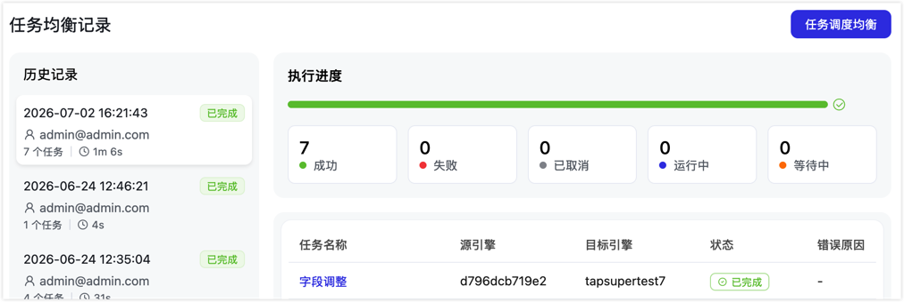
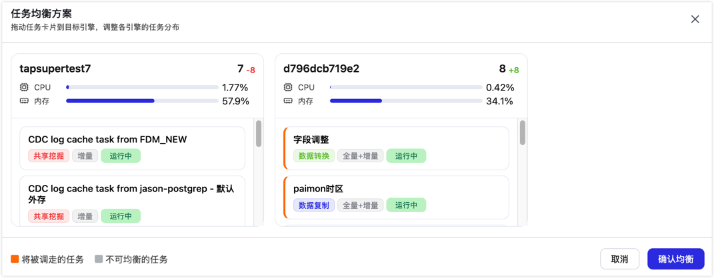

# 任务调度均衡

import Content from '../../reuse-content/_enterprise-features.md';

<Content />

TapData 默认根据各存活引擎的运行任务数量进行调度：任务启动或异常接管时，优先分配到任务数量较少的引擎。当扩缩容、节点恢复或长期运行后任务分布不均时，您可以通过任务调度均衡查看当前分布，并手动调整可均衡任务在引擎之间的分配。

## 前提条件

- 集群中至少存在两台可用的引擎。
- 当前登录账号具备查看任务和执行运维操作的权限。

## 注意事项

- 在新增引擎、节点恢复上线、部分任务集中运行在同一引擎时，可使用任务调度均衡重新整理任务分布。
- 如果任务配置了引擎分组、标签等调度策略，均衡时仍应以页面中展示的可均衡范围为准。
- 对正在处理高峰流量或延迟敏感的任务，建议先确认业务窗口，再执行均衡操作。

## 操作步骤

1. 登录 TapData 平台。

2. 在左侧导航栏，选择**高级功能** > **任务调度均衡**。

   默认展示**任务均衡记录**页面。页面左侧展示历史均衡记录，包括执行时间、操作账号、任务数量、执行耗时和状态；页面右侧展示当前记录的执行进度、成功/失败/已取消/运行中/等待中任务数量，以及每个任务的源引擎、目标引擎、状态和错误原因。

   

3. 单击右上角的**任务调度均衡**。

4. 在**任务均衡方案**对话框中，查看各引擎的任务数量、CPU 使用率、内存使用率和当前运行任务。

   

5. 根据业务需要，将任务卡片拖动到目标引擎。

   - 任务卡片上的标签可帮助您识别任务类型、同步阶段和运行状态。
   - 橙色标识表示将被调走的任务，灰色标识表示不可均衡的任务，不支持拖动调整。
   - 引擎标题右侧的增减数字表示本次均衡后该引擎的任务数量变化。

6. 单击**确认均衡**，提交本次任务调度均衡方案。

7. 返回**任务均衡记录**页面，查看执行进度和任务结果。若存在失败任务，可根据**错误原因**处理后重新发起均衡。

   :::tip

   任务调度均衡会调整任务运行所在的引擎。建议在业务低峰期操作，并在执行完成后确认每个任务的执行结果。

   :::

