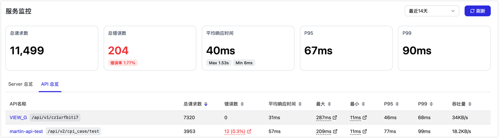
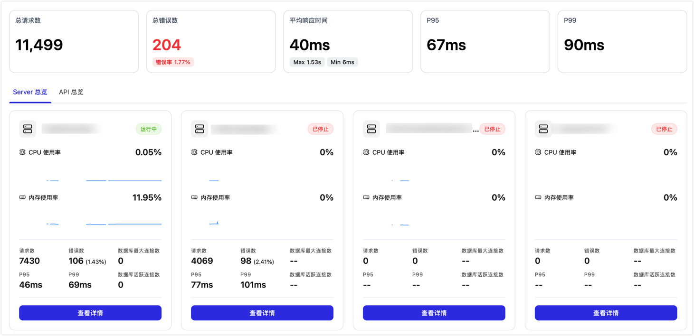

# 服务监控

import Content from '../../reuse-content/_enterprise-features.md';

<Content />

服务监控用于查看 API Server 与 API 的运行情况，帮助您从请求量、错误率、响应时间、资源使用率和数据库连接池等维度定位服务运行问题。

:::tip

CPU、内存等资源指标属于 API Server 维度，请在 **Server 总览**中单击目标 Server 的**查看详情**查看；**API 总览**主要用于按 API 查看请求量、错误数、响应时间和吞吐量等调用指标。

:::

## 操作步骤

1. [登录 TapData 平台](../log-in.md)。

2. 在左侧导航栏，选择**数据服务** > **服务监控**。

3. 在页面右上角选择统计时间范围，或单击**刷新**获取最新数据。

   

## 查看汇总指标

页面上方展示所选时间范围内的服务汇总指标，包含下述信息：

| 指标 | 说明 |
| --- | --- |
| **总请求数** | API Server 接收到的请求总数。 |
| **总错误数** | 请求失败的总数，并展示对应错误率。 |
| **平均响应时间** | 请求的平均响应耗时，同时展示最大值和最小值。 |
| **P95** | 95% 请求的响应时间不超过该值，可用于观察大多数请求的延迟情况。 |
| **P99** | 99% 请求的响应时间不超过该值，可用于观察长尾请求延迟。 |

## 查看 Server 总览

在 **Server 总览**页签中，您可以查看各 API Server 实例的运行状态和核心指标，包括 CPU 使用率、内存使用率、请求数、错误数、P95/P99 响应时间，以及数据库最大连接数和数据库活跃连接数。

单击目标 Server 卡片中的**查看详情**，可进入该 Server 的详情页面。

Server 详情页面展示单个 API Server 在所选时间范围内的运行情况，适合用于排查某个 API Server 是否存在资源瓶颈或请求异常。在详情页面，您可以查看下述信息：

| 区域 | 说明 |
| --- | --- |
| **汇总指标** | 展示当前 Server 的总请求数、总错误数、平均响应时间、P95 和 P99。 |
| **CPU 使用率** | 展示当前 Server 的 CPU 使用率趋势，并可对比最大 CPU 和最小 CPU。 |
| **内存使用率** | 展示当前 Server 的内存使用率趋势，并可对比最大内存和最小内存。 |
| **请求数 & 错误率趋势** | 展示请求量与错误率随时间的变化，用于定位异常高峰或失败率上升时段。 |
| **延迟趋势** | 展示 Avg、P95、P99 响应时间趋势，用于判断延迟是否集中在少量慢请求或整体变慢。 |
| **数据库连接池使用情况** | 选择 API 使用的数据连接后，可查看数据库连接池的使用情况，辅助判断 API 响应变慢是否与数据库连接资源有关。 |

## 查看 API 总览

在 **API 总览**页签中，您可以按 API 查看调用情况。表格中展示 API 名称、访问路径、总请求数、错误数、平均响应时间、最大响应时间、最小响应时间、P95、P99 和吞吐量。

常用排查方式如下：

* 如果**错误数**或错误率较高，优先通过[服务审计](audit-api.md)查看该 API 的错误请求，并检查后端数据源状态。
* 如果 **P95** 或 **P99** 明显高于平均响应时间，说明少量请求耗时较长，可结合 Server 详情中的延迟趋势进一步定位。
* 如果多个 API 同时出现响应变慢，可先查看 **Server 总览**和 Server 详情中的 CPU、内存及数据库连接池使用情况。
