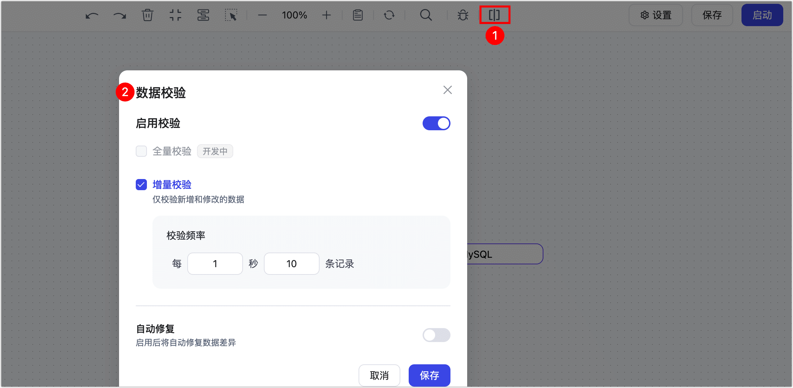
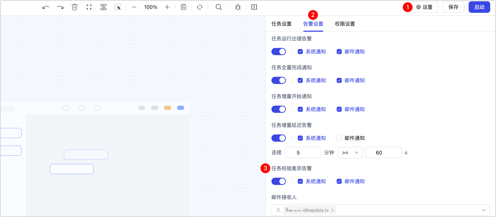
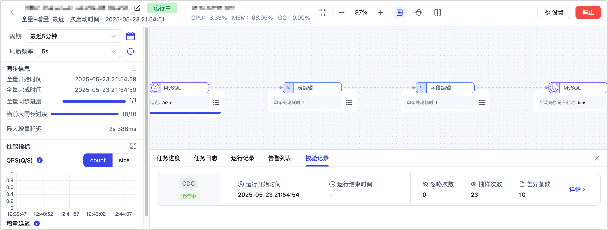

# 增量数据校验

import Content from '../reuse-content/_enterprise-features.md';

<Content />

增量数据校验是一种实时的数据一致性保障方案，通过定期抽样对比源端和目标端在增量数据（新增或变更数据）上的差异，及时发现并自动修复数据不一致的问题，提升数据准确性与一致性。

## 前提条件

执行增量校验的表需具备主键或唯一索引。

## 背景介绍

随着企业实时数据同步和集成场景的增加，数据在不同系统间的实时流转成为刚性需求。然而，实时数据同步面临网络延迟、系统异常、写入失败等诸多问题，导致数据在源端和目标端之间存在不一致，严重影响业务决策与运营效率。

传统的数据校验手段往往依赖于周期性全量校验，不仅耗时长、成本高，而且无法及时发现和解决实时数据的不一致问题，尤其对金融交易、风控监管、实时分析等业务场景更难以满足需求。

为解决这些挑战，TapData 推出了 **增量数据校验** 功能，专注于实时数据的一致性监控。通过低频次、高效率的增量抽样对比，实时发现并自动修复数据差异，极大降低数据异常带来的风险，确保关键业务的数据质量，优势如下：

- **实时性强**：以秒级频率自动抽检新增和变更的数据，快速发现数据差异。
- **自动修复**：发现数据差异后可立即修复，无需人工干预，降低人力成本。
- **资源占用低**：仅校验变更数据，降低对源端现有业务运行的影响。

## 注意事项

- 增量校验期间修改配置可能导致任务自动重启，此外，也应避免执行 DDL 操作，否则任务将停止。
- 源和目标同时存在的字段才会参与校验，TapData 会自动忽略多余或缺少字段（如目标 MongoDB 自动生成的 `_id` 字段）。
- 不支持包含多个源节点（如主从合并）或多个目标节点的任务。
- 任务中可包含表名修改、字段改名节点；但其他处理节点（如 JS 节点修改数据内容）可能改变数据一致性，暂不支持增量校验。
- 为提升校验效率和准确性，二进制字段 (`byte[]`) 将采用 MD5 比对；日期时间字段统一转为标准格式（Instant）再进行比较。

## 操作步骤

1. [登录 TapData 平台](log-in.md)。

2. 完成数据复制或数据转换任务的配置。

3. 在任务监控页面顶部点击  图标，可进入增量数据校验配置界面，支持任务启动前或运行中修改。

4. 在弹出的对话框中，基于业务需求完成增量数据校验配置。

   

   - **增量校验**：启用后可对新增或更新的数据进行抽样校验，及时发现同步过程中的数据差异问题。
   - **校验频率**：控制每秒抽样校验的数据量，TapData 会按主键比对源库和目标库的记录，检查数据是否一致。默认每秒 10 条，建议根据业务压力调整。
   - **自动修复**：启用后，当发现数据不一致时，TapData 会自动从源端重新查询差异记录，并同步修复至目标端，确保数据一致性。

5. 在启动任务前，建议前往页面右上角的**设置**，选择**告警设置**页签，开启任务校验相关的**邮件告警**并**选择收件人**，以便在发现数据不一致时及时收到通知。

   

   :::tip

   关于如何设置收件人，见[通过 QQ 邮箱发送告警信息](../case-practices/best-practice/alert-via-qqmail.md)。

   :::

5. （可选）完成配置并启动任务后，在任务监控页面，可查看到增量校验的执行记录，包括抽样次数、差异条数等。

   

   单击差异条数旁的详情，可在弹出的对话框中查看差异信息的详情，包括源表中的值和目标表中的值等信息。

   