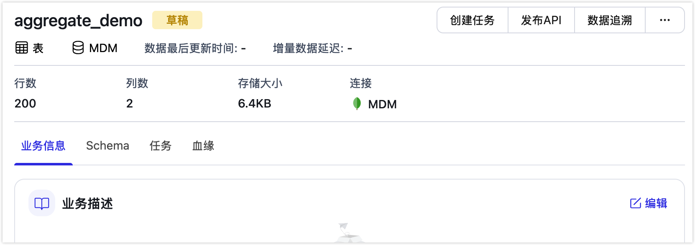
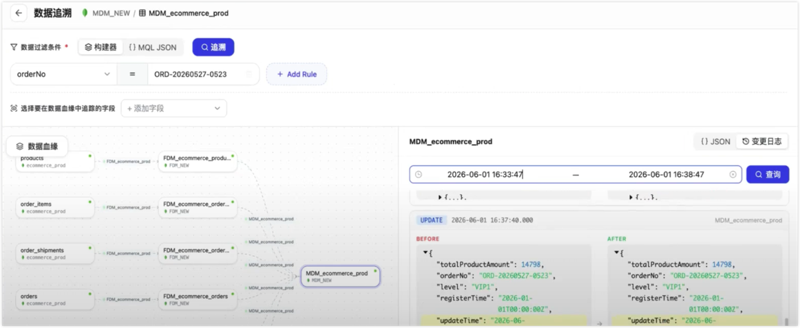

# 数据服务平台界面介绍
import Content from '../../../reuse-content/_enterprise-and-cloud-features.md';

<Content />

开启数据服务平台模式后，页面将基于我们前面[介绍的层级](enable-daas-mode.md)进行分类展示，您只需要简单地拖动表至下一层级，即可自动完成数据复制任务的创建，轻松完成数据的流转。本文介绍如何使用数据服务平台模式的界面，帮助您快速了解各功能模块。

```mdx-code-block
import Tabs from '@theme/Tabs';
import TabItem from '@theme/TabItem';
```

## 操作步骤

1. [登录 TapData 平台](../../log-in.md)。

2. 在左侧导航栏，单击**实时数据中心**。

3. 在本页面，您可以直观地看到您已录入的数据源信息，接下来，我们将介绍各模块的<span id="release320-daas">具体作用</span>。

   


```mdx-code-block
<Tabs className="unique-tabs">
<TabItem value="① 切换视图">
```
单击图标，以目录结构的形式展现数据源信息（再次单击可切换回 Console 视图）。

在**目录视图**下，如果选中具体的表，您还可以在页面右侧看到表详情信息，各标签页介绍如下：


* **概览**：可查看表的基本信息，例如表大小、行数、列类型、列注释、列描述（默认来源为注释信息）、样本数据等。

* **Schema**：可查看表的列详情，如列类型、主键、外键、默认值等。

* **任务**：可查看该表相关的任务及其状态，您也可以在该页签中创建新的任务。 

* **血缘**：以图的形式直观展现数据血缘关系，帮助您更好地管控数据质量，单击任务节点可直接跳转至相关任务的监控页面。
  


</TabItem>

<TabItem value="② 添加数据源">

单击 **+** 图标，在弹出的对话框，我们可以添加数据源，选中某个数据源后将跳转至连接配置页面，具体配置方法，见[连接数据源](../../../prerequisites/README.md)。

</TabItem>

<TabItem value="③ 搜索表">
单击放大镜图标，输入表名的关键词，可帮助您快速定位到具体的表，该操作也支持在其他层级中使用。


</TabItem>

<TabItem value="④ 数据源详情">

在数据连接的右侧，单击图标，页面右侧将展示该数据源的连接信息和关联的任务。


</TabItem>

<TabItem value="⑤ 表详情">

在表名的右侧，单击图标，页面右侧将展示该表关联的任务和表的基本信息，包含表大小、行数、列信息、样本数据、Schema（如主键/外键） 等，该操作在其他层级的模块中也可使用。

对于平台缓存层（FDM）或平台加工层（MDM）中的表，您还可以在表详情页面右上角单击**数据追溯**，进一步查看指定业务记录在上下游链路中的流转过程和变更明细。

此外，当平台加工层的某个表不再需要时，您可以单击该表并在弹出的面板中单击删除（需删除关联的任务）。


</TabItem>

<TabItem value="⑥ 表血缘与数据追溯">

单击图标，即可查看表的血缘关系，快速了解该表的上下游链路，帮助您确认数据来源、加工路径和影响范围。


对于平台缓存层（FDM）或平台加工层（MDM）中的表，您还可以进入表详情页面并单击**数据追溯**，基于指定业务记录查看其在源表、FDM 表和 MDM 表之间的流转链路，并进一步定位各节点中的数据变更。



* **设置数据过滤条件**：在**构建器**模式下选择字段、操作符和值，或切换到 **MQL JSON** 模式编写查询条件，然后单击**追溯**。
* **选择追踪字段**：在**选择要在数据血缘中追踪的字段**区域添加字段，可聚焦查看指定字段在链路中的变化。
* **查看血缘链路**：页面左侧以图形方式展示相关数据表及其上下游关系，单击表节点可查看该节点的明细。
* **查看变更明细**：页面右侧支持按时间范围查询所选节点的数据变化，可在 **JSON** 和**变更日志**视图间切换，查看变更前（Before）和变更后（After）的字段值对比。



:::tip

数据追溯依赖实时数据中心中的数据血缘和可追溯的变更记录。若查询结果为空，请确认过滤条件是否能命中数据、相关任务是否已运行并产生变更记录，且当前账号具备实时数据中心及数据血缘相关查看权限。

:::

</TabItem>

<TabItem value="⑦ 切换模式">

单击图标，在弹出的对话框中，可选择切换回[数据集成模式](../etl-mode/README.md)。

</TabItem>
</Tabs>
