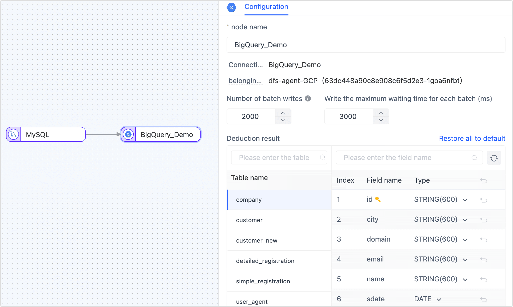

# MySQL to BigQuery Real-Time Sync

[BigQuery](https://cloud.google.com/bigquery/docs?hl=zh-cn) is a completely serverless and cost-effective enterprise data warehouse that works across clouds and scales with your data, with BI, machine learning and AI built in. With Tapdata Cloud, multiple data sources can be synchronized to BigQuery in real time, making it easy to achieve data flow and better meet data architecture changes or big data analysis scenarios.

Taking MySQL as the source data as an example, this article shows how to synchronize its data to BigQuery, and other data source is configured similarly to the flow of this article.

## Preparations

Before you create a replication task, make sure you have configured the relevant data source:

1. [Configure MySQL Connection](../user-guide/connect-database/certified/connect-mysql.md)
2. [Configure BigQuery Connection](../user-guide/connect-database/beta/connect-bigquery.md)

Also note the reference [data type support](../user-guide/no-supported-data-type.md).

## Configure Task

1. Log in to [Tapdata Cloud](https://cloud.tapdata.net/console/v3/).

2. In the left navigation panel, click **Data Replications**.

3. On the right side of the page, click **Create** to configure the task.

4. On the left side of the page, drag the MySQL and BigQuery data sources into the right canvas and connect them.

5. Click the MySQL data source to complete the parameter configuration of the right panel according to the following instructions.

   

   - **Node name**: Defaults to connection name, you can also set a name that has business significance.
   - **DDL event collection**: BigQuery does not support DDL writing, so you do not need to configure this parameter.
   - **Dynamic new tables**: After turning on the switch, Tapdata Cloud automatically synchronizes the source database's new/deleted tables to the target database, only when all tables are selected.
   - **Select a table**: you can select **All** or **Custom**. If you choose **Custom**, you also need to select a table to synchronize below.
   - **Batch read number**: The number of records read in each batch during full data synchronization, the default is **100**.

6. Click the BigQuery data source to preview the data structure and set advanced options.

   1. In the Derivation Result area, preview the post-synchronization data structure. 

      :::tip

      To adjust the field type, click the  icon in the target field type, and in the dialog that pops up, complete the setup.

      :::

   2. Scroll down to the **Advanced Settings** area to complete the advanced setup.

      

      - **Duplicate processing strategy**, **Data write mode**: Choose how duplication data should be handled.

      - **Full multi-threaded write**: The number of concurrent threads with full data written, the default is **8**, which can be appropriately adjusted based on the write performance of the target database.

      - **Incremental multi-threaded write**: The number of concurrent threads with incremental data written, which is disabled by default, can be appropriately adjusted based on the write performance of the target database.

      - **Cursor schema name prefix**: An INSERT operation performed by the source table will be directly synchronized to the target table, and an UPDATE/DELETE operation by the source table will be synchronized to the temporary table of the target dataset, which has the specified name prefix.

         :::tip

         For more information about temporary tables, see [FAQ](#faq).

      - **Data merge delay time**: Tapdata Cloud will merge the data of the temporary table into the target table at the specified time interval. Shorter merge times mean newer data in the target table, and the first merge time is 1 hour after the full data synchronization is completed.

7. After confirming the configuration is correct, click **Start**.

   After the operation is completed, you can observe the performance of the task on the current page, such as QPS, delay, task time statistics, etc.

   

## Task Management

On the Task List page, you can also start, stop, monitor, edit, copy, reset, and delete tasks.

For more information, See [Management Tasks](../user-guide/copy-data/manage-task.md).

##  FAQ

* Q: Why does Agent's machine require access to Google Cloud Services?

   A: The Agent obtains data from the source, processes and transmits it to the target, so it needs to access Google Cloud's BigQuery service to ensure that data can be written to BigQuery.

* Q: How does the temporary table work?

   A: In order to improve the performance of data write and reduce data latency, Tapdata Cloud uses the Stream API and Merge API in combination based on BigQuery data characteristics. The process is as follows:

   1. During the full data synchronization stage, use the Stream API for data import.

   2. In the incremental data synchronization stage, incremental events are first written to BigQuery's temporary table, which is then merged into the target table periodically.

      :::tip

      To avoid not updating data written by the Stream API, the first merge takes place 1 hour after full synchronization data is completed.

      :::

* Q: What are the fields in the temporary table?

   A: The following figure shows the structure and data of a data item in the temporary table. The **merge_data_before** and **merge_data_after** store the data before and after the record change, and the data type is [Record](https://cloud.google.com/bigquery/docs/nested-repeated). Since the **merge_type** of this record is **D** (abbreviation of delete), that is, the data is deleted, the content of **merge_data_after** is empty.

   

* Q: Why is the data queried in BigQuery not up to date?

   A: You can view the incremental delay in the management interface of the task. After excluding the network delay factor, the temporary table may not be merged into the target BigQuery table. You can wait for it to automatically merge before querying.

