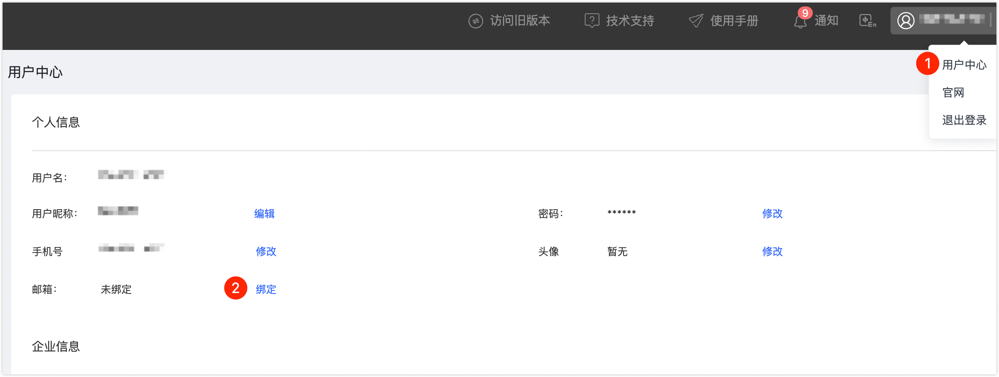
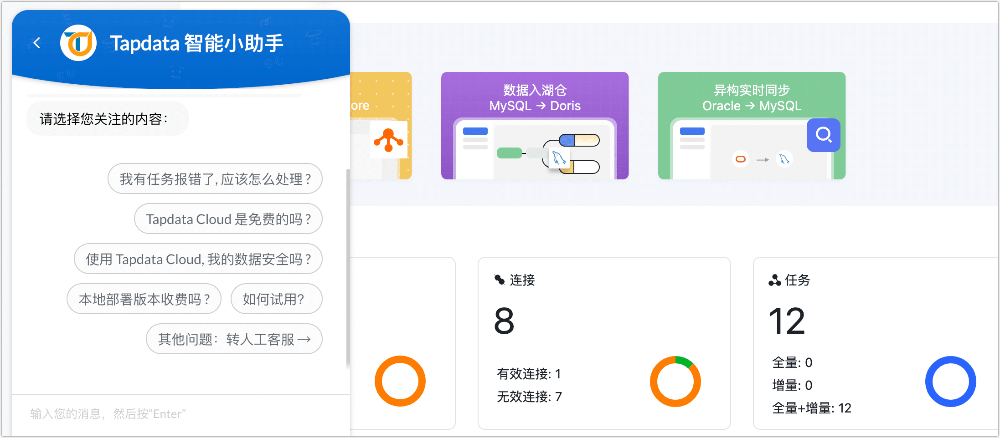

# Technical Support

In addition to consulting the Tapdata documentation, you can also access the original technical support of Tapdata products through the online customer service, user community and ticket system.

## Description of the account

Before you get support, you need to [log in to Tapdata Cloud](https://cloud.tapdata.net/console/v3/) and go to the user center to bind your email, using the email to log in to the user community and ticket system.

## Live Chat

After logging in to [Tapdata Cloud](https://cloud.tapdata.net/console/v3/), click **Connect** in the bottom left corner of the page, the system will provide you with common problems and solutions, if your problem cannot be resolved, you can transfer human services or make voice calls through the chat window.

## User Community

In the [Tapdata user community](https://tapdata.zohodesk.com.cn/portal/zh/community/tapdata-support), you can ask questions about Tapdata products and get technical support, discuss issues encountered, and provide valuable feedback.

:::tip

You can also search for similar issues and solutions before opening a new topic discussion. If your problem involves some information that is not suitable for public disclosure, please use the ticket system for support.

:::

## Ticket System

If similar issues and solutions are not found in the user community, you can also get technical support by [creating a ticket](https://tapdata.zohodesk.com.cn/portal/zh/newticket).

To help us identify and respond to issues faster, please refer to the instructions below to complete the ticket information.

* **Department**: Select **Tapdata Technical Support**.
* **Product name**: Select **Tapdata Cloud**.
* **Version**: Available on the Agent page.
* **Support Type**: Choose according to your question type, such as select **user use question**.
* **Subject**: Describe the problem you are experiencing, which is easy to identify and locate.
* **Description**: Fill in the problem you encountered, the recommendation includes the following information:
   * Task name, or link.
   * Description of the problem
   * Related error log information or screenshot.
   * Type and version of the source/destination database.
