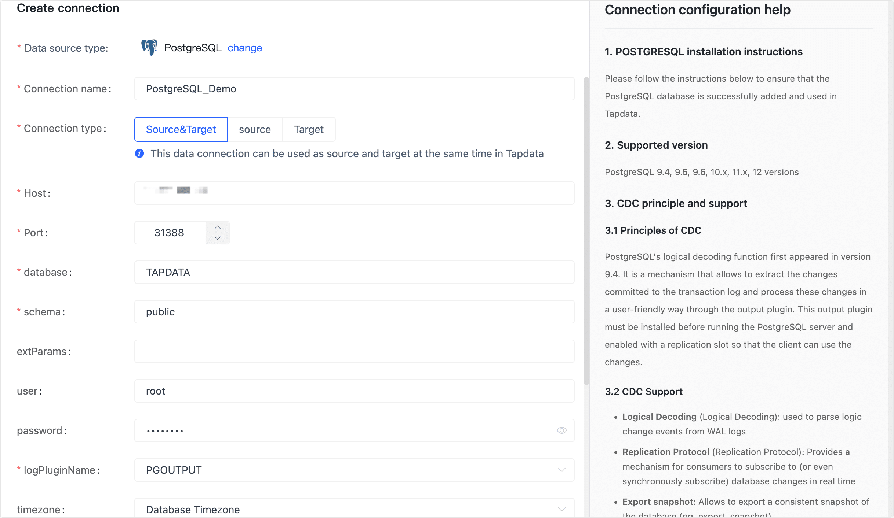

# Connect to PostgreSQL

PostgreSQL is a powerful open-source object-relational database management system (ORDBMS). Tapdata Cloud supports building data pipelines with PostgreSQL as the source and target database, and this article describes how to add PostgreSQL database to Tapdata Cloud.

## Preparations

[Preparations for PostgreSQL](../../../prerequisites/config-database/certified/postgresql.md)

## Procedure

1. Log in to [Tapdata Cloud](https://cloud.tapdata.net/console/v3/).

2. In the left navigation panel, click **Connections**.

3. On the right side of the page, click **Create connection**.

4. In the pop-up dialog, click **GA data source**, and select **PostgreSQL**.

5. On the page that you are redirected to, follow the instructions below to fill in the connection information for PostgreSQL.

   

   * Connection Information Settings

      * **Connection name**: Fill in a unique name that has business significance.
      * **Connection type**: Supports PostgreSQL as a source or target database.
      * **Host**: The database connection address.
      * **Port**: The service port of database.
      * **Database**: database name, a connection corresponding to a database, if there are multiple databases, you need to create multiple connections.
      * **Schema**: Schema name.
      * **extParams**: Additional connection parameters, default empty.
      * **User**: The database account.
      * **Password**: The database password.
      * **Log plugin name**: To read the data changes of PostgreSQL and achieve incremental data synchronization, you need to complete the installation of the plugin according to the guidance of the preparations.
   * Advanced settings

      * **Timezone**: Defaults to the time zone used by the database, which you can also manually specify according to your business needs.
      * **Contain table**: Defaults to **all**, you can also choose to custom and fill in the included tables, separated by commas (,) between multiple tables.
      * **Exclude tables**: After turning on the switch, you can set the tables to be excluded, separated by commas (,) between multiple tables.
      * **Agent settings**: Defaults to **Platform automatic allocation**, you can also manually specify an agent.
      * **Model loading frequency**: When the number of models in the data source is greater than 10,000, Tapdata Cloud will periodically refresh the model according to the set time.

6. Click **Connection Test**, and when passed, click **Save**.

   :::tip

   If the connection test fails, follow the prompts on the page to fix it.

   :::
