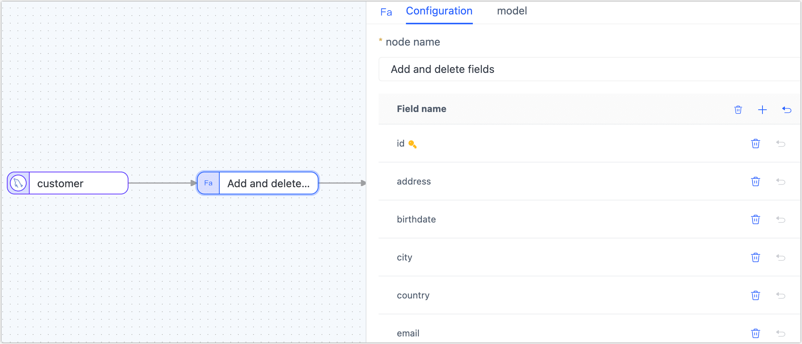
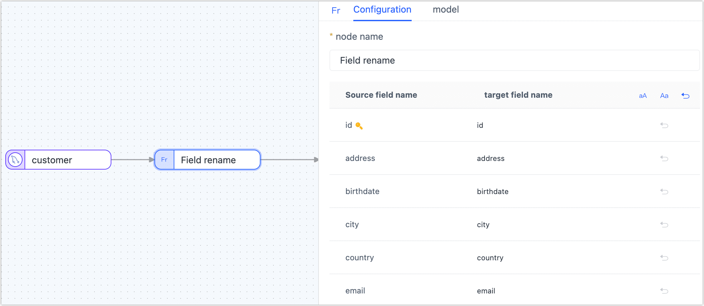
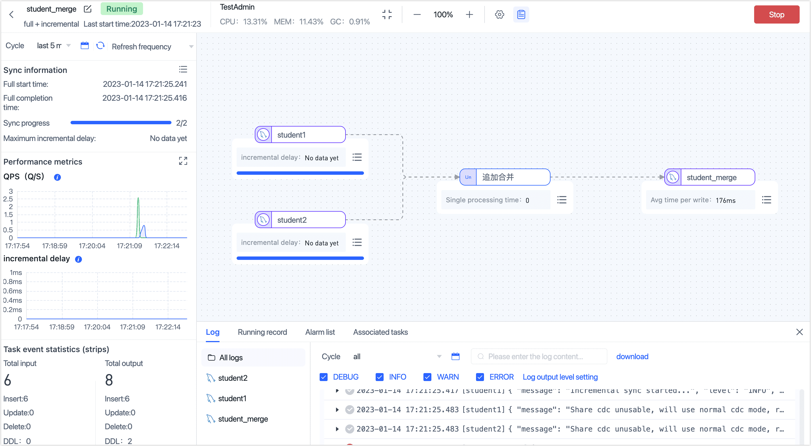

# Add Processing Node

Tapdata Cloud supports the addition of processing nodes to data replication/pipeline tasks, which meets the needs of data filtering, field adjustment, and so on.

## Row Filter

It is mainly used to filter table data, and filtering conditions and execution actions can be set.

* **Execute action**: retain or discard matching data

* **Conditional expression**: An expressionthat sets a filter condition
* **Example expression**: Filter out men over 50 years old or people under 30 years old with incomes of 10,000 years old, `( record.gender == 0&& record.age > 50) || ( record.age >= 30&& record.salary <= 10000)`.


## Add and delete fields

Add and delete fields node can be used to add new fields or delete existing fields. **The node** can be added to the canvas, configure the node parameters after connecting the node to the data node in order of processing. If a field is deleted, it is not passed to the next node.




## Field rename

Use to rename or convert the field case, add the **field rename** node to the canvas, connect the node to the data node in order of processing and then configure the node parameters.




## Field calculation

Assign the value to the field through the calculation between fields, add the **Field calculation** node to the canvas, connect the node to the data node in order of processing, then find the field to be calculated, and configure the calculation rules (support JS).


## Type modification

The Type modification node can be used to adjust the data type of the field.


## <span id="union-node">Union</span>

By **Union** node, you can merge multiple tables with the same/similar structure into one table, and Tapdata Cloud will merge the data with the same field name. The detailed rules are as follows:

- Select the maximum length precision if the type length and precision of the deduction are different.
- If the column type of the deduction is different, convert it to a generic type.
- When the primary key fields of all source tables are consistent, the primary key is retained, otherwise the primary key is removed.
- When the same fields of all source tables have non-empty restrictions, non-empty restrictions are retained, otherwise non-empty restrictions are removed.
- The unique index of the source table is not synchronized to the target table.


**Example scenario:**

Assume that we want to merge(Union) **student1** and **student2** tables with the same table structure into one table, and then store the result in the **student_merge** table. The tables structure and data are as follows:


**Operation**:

1. Log in to [Tapdata Cloud](https://cloud.tapdata.net/console/v3/).

2. In the left navigation bar, click **Data Pipelines**.

3. On the right side of the page, click **Create** to configure the task.

4. On the left side of the page, drag the data source you want to perform the append merge to the right canvas, then drag the **Union** node from the bottom left corner of the page and finally connect them.

   

5. Click the data source you want to perform the append merge, and in the panel on the right side of the page, select the table to be merged (**student1** / **student2**).

6. (Optional) Click the **Union** node and click the **Model** tab to view the table structure information after the append merge.

7. From the left side of the page, drag a data source to store the merged table, and then connect the **Union** node to the data source.

8. Click the data source where the appended merged table is stored, and in the panel on the right side of the page, select the target table (**student_merge**) and advanced settings.

   :::tip

   If you want Tapdata Cloud to automatically create a table structure, you can create an empty table named **student_merge** in the target database in advance (the table structure is unlimited), and then in the **advanced settings**, select **Existing data processing** as **Clear the original table structure and data on the target side**.

   :::

   

9. After confirming the configuration is correct, click **Start**.

   After the operation is completed, you can observe the performance of the task on the current page, such as QPS, delay, task time statistics, etc.

   


**Result verification**

Query the **student_merge** table, and the result is as follows:

```sql
mysql> select * from student_merge;
+---------+------+--------+------+-------+--------+
| stu_id  | name | gender | age  | class | scores |
+---------+------+--------+------+-------+--------+
| 2201101 | Lily | F      |   18 |  NULL |   NULL |
| 2201102 | Lucy | F      |   18 |  NULL |   NULL |
| 2201103 | Tom  | M      |   18 |  NULL |   NULL |
| 2202101 | Lily | F      |   18 |     2 |    632 |
| 2202102 | Lucy | F      |   18 |     2 |    636 |
| 2202103 | Tom  | M      |   18 |     2 |    532 |
+---------+------+--------+------+-------+--------+
6 rows in set (0.00 sec)
```

## <span id="js-process">JS Processing</span>

Supports data processing through JavaScript or Java code. When writing code, it is necessary to check whether it is connected to the source node and the target node.


### Model Declarations

For JS nodes, Tapdata Cloud deduces the model information of the node by sampling data trial run. If the deduced model is found to be inaccurate or the number of fields changes, the field information in the model can be defined explicitly by the model declaration.


In the development task, the method that the model declares support is as follows:

```javascript
// Add a field when the field does not exists
TapModelDeclare.addField(tapTable, 'fieldName', 'TapString')
// Remove an existing field
TapModelDeclare.removeField(tapTable, 'fieldName')
// Update an existing field
TapModelDeclare.updateField(tapTable, 'fieldName', 'TapString')
// Update a field, and add it if it doesn't exist
TapModelDeclare.upsertField(tapTable, 'fieldName', 'TapString')
// Setting a field as primary key
TapModelDeclare.setPk(tapTable, 'fieldName')
// Undo setting primary key
TapModelDeclare.unsetPk(tapTable, 'fieldName')
// Add an index
TapModelDeclare.addIndex(tapTable, 'indexName', [{'filedName':'fieldName1', 'order': 'asc'}])
// Remove an index
TapModelDeclare.removeIndex(tapTable, 'indexName')
```

Parameter Description

- `tapTable`: Fixed parameter, return value of JS node
- `fieldName`: The name of the field to be added or manipulated
- `indexName`: The name of the index to be added or manipulated
- `TapType`: The type of field to be added or the type of the existing field to be modified to the target type. Currently only supports the built-in `TapType`, support:
   - `TapBoolean`: Boolean type, use boolean to store boolean values
   - `TapDate`: Date type, use custom DateTime to store date values
   - `TapArray`: Array type, use Array to store Array values
   - `TapNumber`: Numeric type, use Java's Double to store numeric values
   - `TapBinary`: Binary type, use byte to[] store byte arrays
   - `TapTime`: Time type, use DateTime to store time values
   - `TapMap`: Map type, use Map to store Map values
   - `TapString`: String type, use Java's String to store strings
   - `TapDateTime`: Datetime type, use custom DateTime to store date and time values
   - `TapYear`: Year, use DateTime to store time values


### Use cases

1. Processing data records in a JS node
2. Calling a custom function in a JS node to process data
3. Caching calls in a JS node
4. Other scenarios that require custom processing logic using JS nodes

### JS Built-in Function Description

* [Standard JS](../../appendix/standard-js.md): Supports process and operate on data records, such as converting date strings to Date types.
* [Enhanced JS (Beta)](../../appendix/enhanced-js.md): Supports external calls (such as network, database, etc.) on the basis of standard JS Built-in Function.

