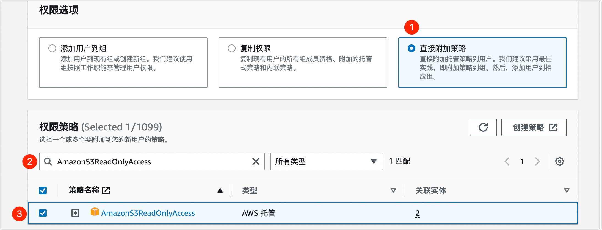
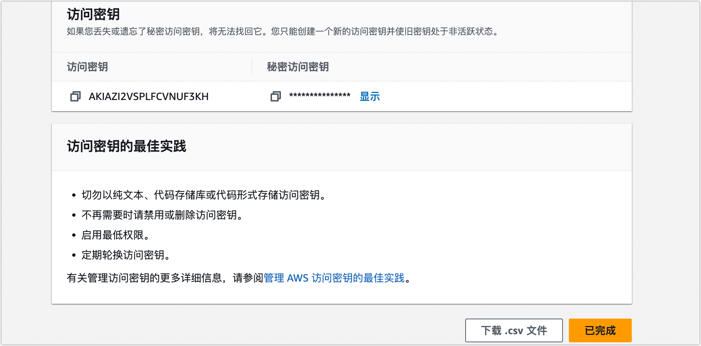

Amazon S3 是一种面向互联网的存储服务。您可以通过 Amazon S3 随时在 Web 上的任何位置存储和检索任意大小的数据。当您的文件存放在 Amazon S3 上时，您需要获取用户的访问密钥、S3 存储桶名称、文件路径等信息。

1. 登录[亚马逊云 IAM 管理控制台](https://console.aws.amazon.com/iamv2/home?#/home)。

2. 创建用户并授权。

   1. 在左侧导航栏，选择**访问管理** > **用户**。

   2. 在页面右侧，单击**创建用户**。

   3. 填写用户名并单击**下一步**。

      用户名最多可包含 64 个字符，有效字符包括：A-Z、a-z、0-9 和 `+ =,. @ _-`

   4. 在**权限选项**区域选择**直接附加策略**，然后搜索并选中 **AmazonS3ReadOnlyAccess** 策略。

      

   5. 单击**下一步**，然后单击**创建用户**。

3. 为用户创建访问密钥。

   1. 在跳转到的用户列表页，找到并单击刚刚创建的用户。

   2. 单击**安全凭证**页签，然后在**访问密钥**区域单击**创建访问密钥**。

      

   3. 选择**第三方服务**并单击**下一步**。

   4. 设置描述标签并单击**创建访问密钥**。

   5. 在页面查看或下载访问密钥信息，包含 **Accesskey**、**Secretkey** 信息。

      

      :::tip

      为保障信息安全，请妥善保存访问密钥。如果意外关闭该页面将无法获取该私有访问密钥，此时您需要创建新的访问密钥。

      :::

4. 获取存储桶的区域代码。

   1. 登录[亚马逊云 S3 控制台](https://console.aws.amazon.com/s3/buckets)。

   2. 在存储桶列表页，找到目标存储桶，查看其区域代码。
   
      

