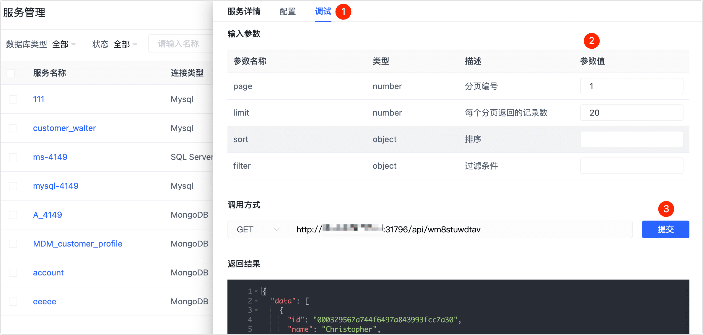
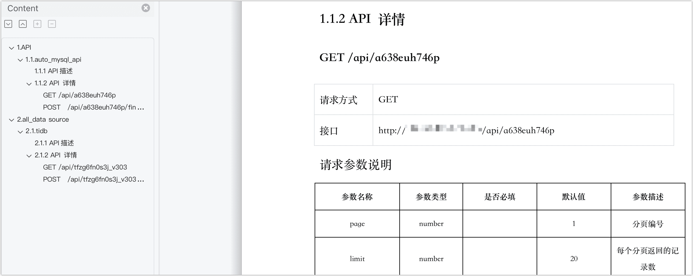

# 创建数据服务

import Content from '../../reuse-content/_enterprise-features.md';

<Content />

为了方便开发人员进行接口对接，同时也方便查看通过 TapData 发布的 API 信息，我们提供了数据服务功能。

## 支持的数据源

目前支持 Doris、MongoDB、MySQL、Oracle、PostgreSQL、SQL Server 和 TiDB。

## 操作步骤

1. [登录 TapData 平台](../log-in.md)。

2. 在左侧导航栏，选择**数据服务** > **服务管理**。

3. 单击页面右上角的**创建服务**，然后根据下述说明完成右侧面板的设置。

   

   * **服务名称**：填写具有业务意义的服务名称，便于后续识别。
   * **权限范围**：选择该 API 服务可由哪个角色调用，更多介绍，见[角色管理](../manage-system/manage-role.md)。
   * **所属应用**：选择所属的应用，方便业务分类管理，更多介绍，见[应用管理](manage-app.md)。
   * **连接类型**、**连接名称**、**对象名称**：分别基于业务需求选择所要查询的对象。
   * **接口类型**：可选**默认查询**或**自定义查询**，选择**自定义查询**时，可设置筛选及可在页面下方设置筛选/排序条件。
   * **访问路径设置**：根据业务需求选择。
     * **默认访问路径**：由 TapData 随机生成唯一的访问地址。
     * **自定义访问路径**：访问路径由**版本**、**前缀**和**基础路径**共同构成，格式为`/api/版本/前缀/基础路径`，支持中文、字母、数字、下划线（_）和美元符号（$），但不能以数字开头。
   * **输入参数**：支持修改参数的默认值。
   * **输出结果**：支持设置输出结果包含的字段。

4. 单击页面右上角的**保存**，然后单击页面右下角的**生成**。

5. 找到刚创建的服务，单击其右侧的**发布**即可使用相关服务。

   如果后续不再需要该 API 服务，可单击其右侧的**下线**。

6. （可选）单击刚创建的服务，在右侧面板中选择**调试**页签，填写请求参数后单击**提交**来验证服务可用性。

   

7. （可选）对于已创建的数据服务，您可以将其选中并导出备份或分享给其他团队成员，您也可以导入数据服务。

   

   除此以外，对于已发布的数据服务，您还可以将其选中并单击 **API 文档导出**，可在团队内部快速建立 API 的使用资料，导出的 Word 文件为 docx 格式，包含数据服务名称、API 描述、GET/POST 的参数说明和使用示例等信息，具体如下图所示。

   

   
