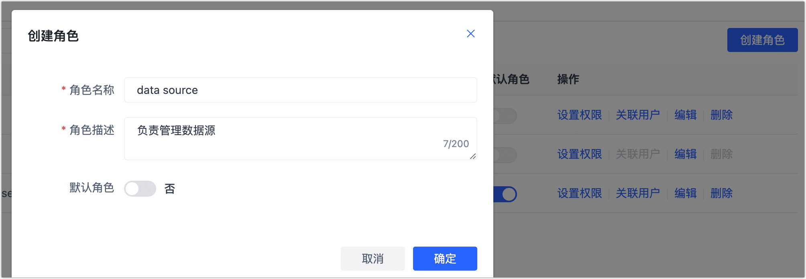

# 管理角色

import Content from '../../reuse-content/_enterprise-features.md';

<Content />

角色是一个或多个权限合集，您可以为一个角色授予多个操作权限，然后将角色授予给[用户](manage-user.md)，该用户将继承该角色中的所有权限。基于此设计，您可以基于业务需求预先创建好角色，随后在创建用户直接赋予其角色，无需为每个用户配置权限，从而简化运维管理，提升安全性。

## 操作步骤

1. 以系统管理员身份[登录 TapData 平台](../log-in.md)。

2. 在左侧导航栏，选择**系统管理** > **角色管理**。

3. 创建新角色。
   1. 在页面右侧，单击**创建角色**。
   
   2. 在弹出的对话框中，填写角色名称和描述，并设置是否为默认角色。
   
      
   
4. 如需对已有角色进行管理，可选择要执行的操作：

   * **设置角色权限**：单击目标角色的**设置权限**，在跳转到的页面中，选择该角色拥有的权限。

     :::tip

     * 如下图所示，我们仅为其赋予了**连接管理**的权限，该用户登录 TapData 后，仅可看到连接管理管理菜单，而且不允许该角色创建和复制连接。
     * 当前支持精细权限控制的功能模块为连接管理和数据管道。
   
     :::
   
     
   
   * **为角色关联用户**：单击目标角色的**关联用户**，在弹出的对话框中，选择目标用户（可多选）并单击**确定**，该用户即可自动继承当前角色的所有权限。
   
   * **编辑角色基本信息**：单击目标角色的**编辑**，设置角色名称、描述、是否为默认角色。
   
   * **删除角色**：确保目标角色没有关联任何角色，单击目标角色的**删除**，在弹出的对话框中单击**确定**。
   
     :::caution
   
     角色被删除后不可恢复，请谨慎操作。
   
     :::
