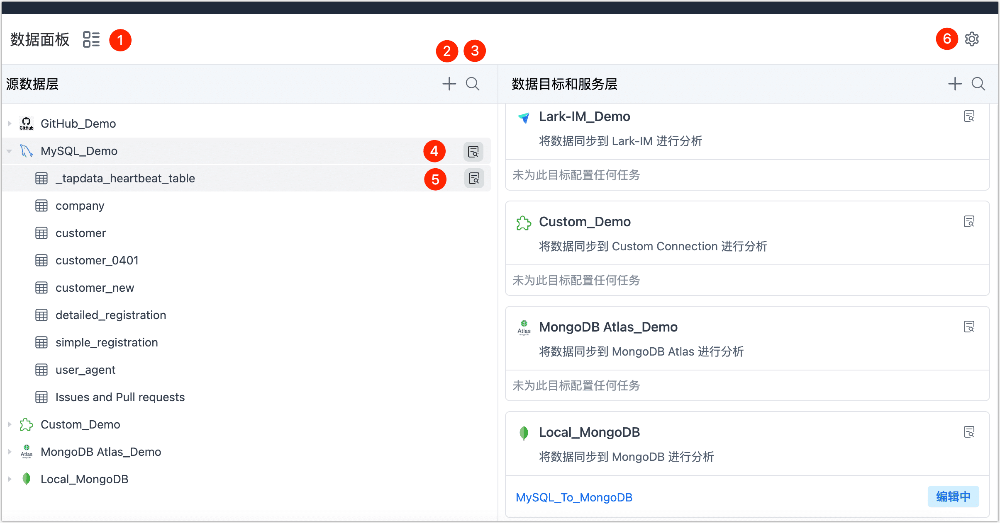

# 数据集成界面介绍
import Content from '../../../reuse-content/_enterprise-and-cloud-features.md';

<Content />

实时数据中心功能默认为数据集成模式，该模式适用于数据复制/同步、数据上云或构建 ETL 管道，您只需要简单地拖动源表至目标即可自动完成数据复制任务的创建，可帮助您简化任务配置流程。本文介绍如何使用数据集成模式的界面，帮助您快速了解各功能模块。

```mdx-code-block
import Tabs from '@theme/Tabs';
import TabItem from '@theme/TabItem';
```

:::tip

随着源库承载的任务增多，为最大限度地降低数据提取对源库的影响，同时契合您组织的数据分层治理的理念，您也可以[开启数据服务平台模式（Beta）](../daas-mode/enable-daas-mode.md)，将数据实时同步至平台缓存层。

:::

## 操作步骤

1. [登录 TapData 平台](../../log-in.md)。

2. 在左侧导航栏，单击**实时数据中心**。

3. 在本页面，您可以直观地看到您已录入的数据源信息，接下来，我们将介绍各模块的具体作用。

   

```mdx-code-block
<Tabs className="unique-tabs">
<TabItem value="① 切换视图">
```
单击图标，以目录结构的形式展现数据源信息（再次单击可切换回 Console 视图）。

在目录视图下，如果选中具体的表，您还可以在页面右侧看到表详情信息，各标签页介绍如下：


* **概览**：可查看表的基本信息，例如表大小、行数、列类型、列注释、列描述（默认来源为注释信息）、样本数据等。
* **Schema**：可查看表的列详情，如列类型、主键、外键、默认值等。
* **任务**：可查看该表相关的任务及其状态，您也可以在该页签中创建新的任务。
* **血缘**：以图的形式直观展现数据血缘关系，帮助您更好地管控数据质量，单击任务节点可直接跳转至相关任务的监控页面。


</TabItem>

<TabItem value="② 添加数据源">

单击 **+** 图标，在弹出的对话框，我们可以添加数据源，选中某个数据源后将跳转至连接配置页面，具体配置方法，见[连接数据源](../../../prerequisites/README.md)。

</TabItem>

<TabItem value="③ 搜索表">
单击放大镜图标，输入表名的关键词，可帮助您快速定位到具体的表，该操作在其他层级的模块中也可使用。


</TabItem>

<TabItem value="④ 数据源详情">
在数据连接的右侧，单击详情图标，页面右侧将展示该数据源的连接信息和关联的任务。


</TabItem>

<TabItem value="⑤ 表详情">

在表名的右侧，单击图标，页面右侧将展示该表关联的任务和表的基本信息，包含表大小、行数、列信息、样本数据、Scheme（如主键/外键) 等。


</TabItem>

<TabItem value="⑥ 切换模式">

单击图标，在弹出的对话框中，可选择[开启数据服务平台模式](../daas-mode/enable-daas-mode.md)，将数据实时同步至平台缓存层。

</TabItem>
</Tabs>